# HL_TFW-1 — Каталог сущностей ЕПВО: контекст и модель данных

## Назначение
Полный каталог всех сущностей (справочников), которые необходимо передавать в ЕПВО через API. Для каждой сущности описаны: код справочника, JSON-схема полей, составной ключ для идентификации, typeCode для дискриминатора, и логическая группа.

## Источник данных
OpenAPI 3.0.1 спецификация: `https://epvo.kz/isvuz/api/v3/api-docs`
Сохранена локально: `RF__api_spec.json`

## Общая архитектура данных ЕПВО

### Два типа справочников

1. **OrgData (Организационные данные)** — данные конкретного вуза. Вуз СОЗДАЁТ / ОБНОВЛЯЕТ / УДАЛЯЕТ записи.
   - Эндпоинт: `/org-data/{code}/...`
   - ~90+ справочников (enum `OrgDataDictionaryCode`)
2. **CommonDictionary (Системные справочники)** — централизованные справочники МОН. Только ЧТЕНИЕ.
   - Эндпоинт: `/common-dictionary/{code}/...`
   - ~50+ справочников (enum `SystemDictionaryCode`)

### Механизм дискриминации типов

Каждая сущность при сохранении требует:
- **`typeCode`** — код справочника из `OrgDataDictionaryCode` (напр. `"CAFEDRA"`)
- **Составной ключ (`type`)** — определяет формат первичного ключа из `AbstractPrimaryKey`

### Правила составных ключей (Composite Keys)

| Таблица(ы) | Значение `type` |
|------------|-----------------|
| STUDENT, STUDENT_DIPLOMA_INFO, STUDENT_INFO | `STUDENT_ID_COMPOSITE_KEY` |
| BUILDINGS, SPORTS_CONSTRUCTIONS | `BUILDING_ID_COMPOSITE_KEY` |
| TERMS | `TERM_ID_COMPOSITE_KEY` |
| STUDYCALENDAR | `STUDY_CALENDAR_ID_COMPOSITE_KEY` |
| WORK_TYPE | `WORK_TYPE_ID_COMPOSITE_KEY` |
| CAFEDRA | `CAFEDRA_ID_COMPOSITE_KEY` |
| FACULTIES | `FACULTY_ID_COMPOSITE_KEY` |
| Если нет специального ключа | `UNIVERSITY_ID_COMPOSITE_KEY` |

---

## Логические группы сущностей

### Группа 1: Структура университета
Базовые справочники организационной структуры.

| # | OrgDataCode | Схема API | Описание | CompositeKey type |
|---|-------------|-----------|----------|-------------------|
| 1 | `UNIVERSITY` | `University` | Сведения о вузе | `UNIVERSITY_ID_COMPOSITE_KEY` |
| 2 | `UNIVERSITIES` | `Universities` | Перечень вузов | `UNIVERSITY_ID_COMPOSITE_KEY` |
| 3 | `FACULTIES` | `Faculties` | Факультеты | `FACULTY_ID_COMPOSITE_KEY` |
| 4 | `CAFEDRA` | `Cafedra` | Кафедры | `CAFEDRA_ID_COMPOSITE_KEY` |
| 5 | `STRUCTURAL_SUBDIVISION` | `StructuralSubdivision` | Структурные подразделения | `UNIVERSITY_ID_COMPOSITE_KEY` |

### Группа 2: Образовательные программы и специальности
Справочники ОП, специальностей, учебных планов.

| # | OrgDataCode | Схема API | Описание | CompositeKey type |
|---|-------------|-----------|----------|-------------------|
| 6 | `PROFESSION` | `Profession` | ГОП/Специальности | `PROFESSION_ID_COMPOSITE_KEY` |
| 7 | `PROFESSION_CAFEDRA` | `ProfessionCafedra` | Связь ОП ↔ кафедра | `UNIVERSITY_ID_COMPOSITE_KEY` |
| 8 | `PROFESSION_COST` | `ProfessionCost` | Стоимость обучения по ОП | `PROFESSION_COST_ID_COMPOSITE_KEY` |
| 9 | `SPECIALIZATIONS` | `Specializations` | ОП (образовательные программы) | `UNIVERSITY_ID_COMPOSITE_KEY` |
| 10 | `EDUCATION_PROGRAMS_CODE` | `EducationProgramsCode` | Коды ОП при аккредитации | `UNIVERSITY_ID_COMPOSITE_KEY` |
| 11 | `TYP_CURRICULUM` | `TypCurriculum` | Типовые учебные планы | `CURRICULUM_ID_COMPOSITE_KEY` |
| 12 | `STUDY_FORMS` | `StudyForms` | Формы обучения | `UNIVERSITY_ID_COMPOSITE_KEY` |

### Группа 3: Студенты и обучающиеся
Данные по контингенту.

| # | OrgDataCode | Схема API | Описание | CompositeKey type |
|---|-------------|-----------|----------|-------------------|
| 13 | `STUDENT` | `Student` | Обучающиеся | `STUDENT_ID_COMPOSITE_KEY` |
| 14 | `STUDENT_INFO` | `StudentInfo` | Доп. информация об обучающихся | `STUDENT_ID_COMPOSITE_KEY` |
| 15 | `STUDENT_DIPLOMA_INFO` | `StudentDiplomaInfo` | Данные о дипломах обучающихся | `STUDENT_ID_COMPOSITE_KEY` |
| 16 | `STUDENT_BENEFIT` | `StudentBenefit` | Льготы обучающихся | `UNIVERSITY_ID_COMPOSITE_KEY` |
| 17 | `STUDENT_TRANSFER` | `StudentTransfer` | Академическая мобильность | `TRANSFER_ID_COMPOSITE_KEY` |
| 18 | `STUDENT_PRACTICES` | `StudentPractices` | Практики обучающихся | `STUDENT_PRACTICE_ID_COMPOSITE_KEY` |
| 19 | `STUDENT_PROJECTS` | `StudentProjects` | Научные проекты обучающихся | `UNIVERSITY_ID_COMPOSITE_KEY` |
| 20 | `STUDENTS_ADMISSION_SUBJECTS` | `StudentsAdmissionSubjects` | Предметы поступления | `UNIVERSITY_ID_COMPOSITE_KEY` |
| 21 | `EXTERNAL_LISTENER` | `ExternalListener` | Слушатели | `EXTERNAL_LISTENER_ID_COMPOSITE_KEY` |
| 22 | `PERSONAL_ACHIEVEMENTS` | `PersonalAchievements` | Личные достижения | `UNIVERSITY_ID_COMPOSITE_KEY` |

### Группа 4: Академические группы
Группы, подгруппы, взводы.

| # | OrgDataCode | Схема API | Описание | CompositeKey type |
|---|-------------|-----------|----------|-------------------|
| 23 | `GROUPS` | `Groups` | Академические группы | `GROUP_ID_COMPOSITE_KEY` |
| 24 | `GROUP_TYPE` | `GroupType` | Типы групп | `GROUP_TYPE_ID_COMPOSITE_KEY` |
| 25 | `STUDY_GROUP` | `StudyGroup` | Учебные группы (привязка студент-группа) | `STUDY_GROUP_ID_COMPOSITE_KEY` |
| 26 | `FOUNDATION_GROUP` | `FoundationGroup` | Группы подготовительного отделения | `UNIVERSITY_ID_COMPOSITE_KEY` |
| 27 | `PLATOON` | `Platoon` | Взводы (военная кафедра) | `PLATOON_ID_COMPOSITE_KEY` |
| 28 | `PLATOON_STUDENTS` | `PlatoonStudents` | Обучающиеся во взводах | `UNIVERSITY_ID_COMPOSITE_KEY` |

### Группа 5: Преподаватели (ППС)
Данные о профессорско-преподавательском составе.

| # | OrgDataCode | Схема API | Описание | CompositeKey type |
|---|-------------|-----------|----------|-------------------|
| 29 | `TUTOR` | `Tutor` | Преподаватели | `TUTOR_ID_COMPOSITE_KEY` |
| 30 | `TUTOR_CAFEDRA` | `TutorCafedra` | Связь преподаватель ↔ кафедра | `UNIVERSITY_ID_COMPOSITE_KEY` |
| 31 | `TUTOR_CAFEDRA_TRAINING_DIRECTIONS` | `TutorCafedraTrainingDirections` | Направления подготовки преподавателя | `UNIVERSITY_ID_COMPOSITE_KEY` |
| 32 | `TUTOR_POSITIONS` | `TutorPositions` | Должности преподавателей | `UNIVERSITY_ID_COMPOSITE_KEY` |
| 33 | `TUTOR_SUBJECT` | `TutorSubject` | Дисциплины преподавателя | `TUTOR_SUBJECT_ID_COMPOSITE_KEY` |
| 34 | `TUTOR_PUBLICATION` | `TutorPublication` | Публикации преподавателей | `PUB_ID_COMPOSITE_KEY` |
| 35 | `TUTOR_QUALIFICATION` | `TutorQualification` | Квалификация преподавателей | `QUAL_ID_COMPOSITE_KEY` |
| 36 | `TUTOR_AWARDS` | `TutorAwards` | Награды преподавателей | `UNIVERSITY_ID_COMPOSITE_KEY` |

### Группа 6: Учебный процесс
Дисциплины, транскрипты, расписание.

| # | OrgDataCode | Схема API | Описание | CompositeKey type |
|---|-------------|-----------|----------|-------------------|
| 37 | `SUBJECT` | `Subject` | Каталог дисциплин | `SUBJECT_ID_COMPOSITE_KEY` |
| 38 | `TUP_SUBJECT` | `TupSubject` | Дисциплины ТУП | `TUP_SUBJECT_ID_COMPOSITE_KEY` |
| 39 | `TRANSCRIPT` | `Transcript` | Транскрипты обучающихся | `UNIVERSITY_ID_COMPOSITE_KEY` |
| 40 | `DELETED_TRANSCRIPT` | `DeletedTranscript` | Транскрипты выпускников | `UNIVERSITY_ID_COMPOSITE_KEY` |
| 41 | `GENERAL_EXAMS_MARKS` | `GeneralExamsMarks` | Оценки гос. аттестации | `MARK_ID_COMPOSITE_KEY` |
| 42 | `SESSION_REPORT` | `SessionReport` | Отчёты по сессиям | `REPORT_ID_COMPOSITE_KEY` |
| 43 | `Q_EXAMINATIONS` | `QExaminations` | Типы гос. аттестации | `UNIVERSITY_ID_COMPOSITE_KEY` |
| 44 | `TERMS` | `Terms` | Семестры | `TERM_ID_COMPOSITE_KEY` |
| 45 | `STUDYCALENDAR` | `StudyCalendar` | Учебный календарь | `STUDY_CALENDAR_ID_COMPOSITE_KEY` |
| 46 | `WORK_TYPE` | `WorkType` | Виды учебных работ | `WORK_TYPE_ID_COMPOSITE_KEY` |

### Группа 7: Приказы
Приказы по движению контингента и кадрам.

| # | OrgDataCode | Схема API | Описание | CompositeKey type |
|---|-------------|-----------|----------|-------------------|
| 47 | `ORDERS` | `Orders` | Приказы по обучающимся | `ORDER_ID_COMPOSITE_KEY` |
| 48 | `ORDERS_ADDITIONAL` | `OrdersAdditional` | Дополнительные приказы | `UNIVERSITY_ID_COMPOSITE_KEY` |
| 49 | `ORDERS_ACADEMIC_MOBILITY` | `OrdersAcademicMobility` | Приказы по АМ | `UNIVERSITY_ID_COMPOSITE_KEY` |
| 50 | `ORDER_SECTIONS` | `OrderSections` | Параграфы приказов | `SECTION_ID_COMPOSITE_KEY` |
| 51 | `ORDER_STUDENT_INFO` | `OrderStudentInfo` | Обучающиеся в приказах | `ORDER_STUDENT_INFO_ID_COMPOSITE_KEY` |
| 52 | `COURSE_TRANSFER_ORDER` | `CourseTransferOrder` | Приказы о переводе с курса на курс | `UNIVERSITY_ID_COMPOSITE_KEY` |
| 53 | `EMPLOYEE_ORDERS` | `EmployeeOrders` | Приказы по сотрудникам | `UNIVERSITY_ID_COMPOSITE_KEY` |
| 54 | `ORDER_INTERNSHIP_STUDENTS` | `OrderInternshipStudents` | Приказы стажировки | `UNIVERSITY_ID_COMPOSITE_KEY` |

### Группа 8: Инфраструктура
Корпуса, аудитории, лаборатории.

| # | OrgDataCode | Схема API | Описание | CompositeKey type |
|---|-------------|-----------|----------|-------------------|
| 55 | `BUILDINGS` | `Buildings` | Прочие корпуса | `BUILDING_ID_COMPOSITE_KEY` |
| 56 | `EDUCATION_BUILDINGS` | `EducationBuildings` | Учебные корпуса | `EDUC_BUILDING_ID_COMPOSITE_KEY` |
| 57 | `SCIENCE_BUILDINGS` | `ScienceBuildings` | Научные корпуса | `UNIVERSITY_ID_COMPOSITE_KEY` |
| 58 | `SPORTS_CONSTRUCTIONS` | `SportsConstructions` | Спортивные сооружения | `BUILDING_ID_COMPOSITE_KEY` |
| 59 | `DORMITORY` | `Dormitory` | Общежития | `DORMITORY_ID_COMPOSITE_KEY` |
| 60 | `LABORATORIES` | `Laboratory` | Лаборатории | `LABORATORY_ID_COMPOSITE_KEY` |
| 61 | `AUDITORIES` | `Auditory` | Аудитории | `AUDITORY_ID_COMPOSITE_KEY` |
| 62 | `AUDITORY_TYPES` | `AuditoryType` | Типы аудиторий | `AUDITORY_TYPE_ID_COMPOSITE_KEY` |

### Группа 9: Выпускники
Данные о выпускниках и дипломах.

| # | OrgDataCode | Схема API | Описание | CompositeKey type |
|---|-------------|-----------|----------|-------------------|
| 63 | `GRADUATES` | `Graduates` | Выпускники | `GRADUATE_ID_COMPOSITE_KEY` |
| 64 | `RETIRES` | `Retires` | Отчисленные | `UNIVERSITY_ID_COMPOSITE_KEY` |
| 65 | `DIPLOMA_DUPLICATES` | `DiplomaDuplicate` | Дубликаты дипломов | `DIPLOMA_DUPLICATE_ID_COMPOSITE_KEY` |

### Группа 10: Финансы
Финансовые данные вуза.

| # | OrgDataCode | Схема API | Описание | CompositeKey type |
|---|-------------|-----------|----------|-------------------|
| 66 | `U_CONTRACT` | `UContract` | Договоры вуза | `CONTRACT_ID_COMPOSITE_KEY` |
| 67 | `U_FINANCING` | `UFinancing` | Финансирование | `UNIVERSITY_ID_COMPOSITE_KEY` |
| 68 | `U_PROFIT` | `UProfit` | Доходы вуза | `PROFIT_ID_COMPOSITE_KEY` |
| 69 | `U_RATING` | `URating` | Рейтинг вуза | `URATING_ID_COMPOSITE_KEY` |
| 70 | `SCHOLARSHIP` | `Scholarship` | Стипендии | `UNIVERSITY_ID_COMPOSITE_KEY` |
| 71 | `UNIVERSITY_FINANCING` | `UniversityFinancing` | Финансирование по годам | `UNIVERSITY_ID_COMPOSITE_KEY` |

### Группа 11: Международное сотрудничество
Зарубежные вузы, соглашения, АМ.

| # | OrgDataCode | Схема API | Описание | CompositeKey type |
|---|-------------|-----------|----------|-------------------|
| 72 | `FOREIGN_UNIVERSITIES` | `ForeignUniversities` | Зарубежные вузы | `UNIVERSITY_ID_COMPOSITE_KEY` |
| 73 | `FOREIGN_UNIVERSITIES_AGREEMENT` | `ForeignUniversitiesAgreement` | Соглашения с вузами | `UNIVERSITY_ID_COMPOSITE_KEY` |
| 74 | `FOREIGN_SUBJECTS` | `ForeignSubjects` | Дисциплины при АМ | `UNIVERSITY_ID_COMPOSITE_KEY` |
| 75 | `FOREIGN_LANG_CERTIFICATE` | `ForeignLangCertificate` | Языковые сертификаты | `UNIVERSITY_ID_COMPOSITE_KEY` |
| 76 | `FINANCING_SOURCE_ACADEMIC_MOBILITY` | `FinancingSourceAcademicMobility` | Финансирование АМ | `UNIVERSITY_ID_COMPOSITE_KEY` |
| 77 | `DSPIT_FORM_3` | `DspitForm3` | Международное сотрудничество | `UNIVERSITY_ID_COMPOSITE_KEY` |

### Группа 12: Наука
Научные степени, статусы, проекты.

| # | OrgDataCode | Схема API | Описание | CompositeKey type |
|---|-------------|-----------|----------|-------------------|
| 78 | `SCIENTIFIC_DEGREE` | `ScientificDegree` | Академическая степень сотрудников | `UNIVERSITY_ID_COMPOSITE_KEY` |
| 79 | `ACADEMIC_STATUS` | `AcademicStatus` | Академический статус | `UNIVERSITY_ID_COMPOSITE_KEY` |
| 80 | `SCIENCE_FIELDS` | `ScienceFields` | Научные области | `UNIVERSITY_ID_COMPOSITE_KEY` |
| 81 | `SCIENTIFIC_PROJECTS` | `ScientificProjects` | Научные проекты | `UNIVERSITY_ID_COMPOSITE_KEY` |
| 82 | `PROJECTS_FUNDING_SOURCE` | `ProjectsFundingSource` | Источники финансирования проектов | `UNIVERSITY_ID_COMPOSITE_KEY` |

### Группа 13: Вспомогательные справочники вуза
Награды, аккредитация, типы организации, практики.

| # | OrgDataCode | Схема API | Описание | CompositeKey type |
|---|-------------|-----------|----------|-------------------|
| 83 | `AWARDS` | `Awards` | Награды | `UNIVERSITY_ID_COMPOSITE_KEY` |
| 84 | `AWARD_TYPES` | `AwardTypes` | Виды наград | `UNIVERSITY_ID_COMPOSITE_KEY` |
| 85 | `ACCREDITATION_AGENCIES` | `AccreditationAgencies` | Аккредитационные агентства | `UNIVERSITY_ID_COMPOSITE_KEY` |
| 86 | `UNIVERSITY_ACCREDITATION` | `UniversityAccreditation` | Аккредитация вуза | `UNIVERSITY_ID_COMPOSITE_KEY` |
| 87 | `ORGANIZATION_TYPES` | `OrganizationTypes` | Типы организаций | `UNIVERSITY_ID_COMPOSITE_KEY` |
| 88 | `PRACTICE_CONTRACT` | `PracticeContract` | Договоры практик | `PRACTICE_CONTRACT_ID_COMPOSITE_KEY` |
| 89 | `SECTION_PERSON` | `SectionPerson` | Спортивные секции | `UNIVERSITY_ID_COMPOSITE_KEY` |
| 90 | `QUERY` | `Query` | Запросы | `QUERY_ID_COMPOSITE_KEY` |

---

## Системные справочники (CommonDictionary) — только чтение

Эти справочники управляются централизованно МОН через Platonus. Вуз загружает их для маппинга ID.

| Код системного справочника | Схема API | Описание |
|----------------------------|-----------|----------|
| AM | AcademicMobilityType | Типы академической мобильности |
| AS | AcademicStatus (center) | Академический статус (центр.) |
| APT | AdditionalPaymentType | Виды доплат |
| BE | BaseEducation | Базовое образование |
| B | Benefits | Категории льгот |
| CAS | CenterAcademicStatus | Академический статус (центр.) |
| CA | CenterAwards | Виды наград (центр.) |
| CAT | CenterAwardTypes | Типы наград (центр.) |
| CAE | CenterAcademicExchangeProgram | Программы академ. обмена |
| CC | CenterCountry | Страны мира |
| CN | CenterNationality | Национальности |
| CP | CenterProfession | Специальности/ГОП (центр.) |
| CR | CenterRegion | Регионы |
| CSD | CenterScientificDegree | Научные степени (центр.) |
| CSL | CenterStudyLanguages | Языки обучения |
| CTD | CenterTrainingDirection | Направления подготовки |
| DC | DisabilityCategories | Категории инвалидности |
| DT | DegreeTypes | Академические степени |
| D | Department | Отделения |
| DRE | DicReasonEmployment | Причины трудоустройства |
| DPT | DspitProgramTypes | Виды программ |
| DS | DormStates | Статусы общежития |
| EC | EducationConditions | Условия обучения |
| EEL | EntranceExamLanguage | Язык вступ. экзамена |
| GT | GrantTypes | Виды грантов |
| HJ | HasJobs | Трудоустройство выпускника |
| IC | IcDepartment | Орган выдачи документа |
| IT | ICType | Типы удостоверяющих документов |
| I | Institution | Образовательные учреждения |
| JPT | JobPlaceType | Типы организаций трудоустройства |
| MS | MaritalStates | Семейное положение |
| OC | OrderCategory | Категории приказов |
| OT | OrderType | Типы приказов |
| OF | OrganizationForms | Виды организаций |
| PF | PaymentForms | Формы оплаты |
| POFE | PlaceOfFurtherEducation | База повышения квалификации |
| PT | ProfessionType | Направления специальностей |
| PL | PublicationLevel | Уровень публикации |
| PuT | PublicationType | Вид публикации |
| QF | QualificationForm | Форма повышения квалификации |
| RS | ResidenceState | Место окончания школы |
| ST | ScholarshipTermination | Причины прекращения стипендии |
| STy | ScholarshipType | Виды стипендий |
| SD | ScientificDegree (center) | Научная степень (центр.) |
| S | Sex | Пол |
| SFA | SubjectForAdmission | Предметы для поступления |
| SPD | ScientificProjectsDirections | Направления проектов |
| TP | TrainingProgram | Программы подготовки |
| UT | UniversityType | Типы вузов |
| CB | CenterBank | Банки второго уровня |
| UIS | UniversityInfSystem | ИС ОВПО |
| SBT | SubjectType | Типы предметов |
| CEOC | CenterEmployeeOrderCategory | Категории приказов работника |
| CEOT | CenterEmployeeOrderType | Виды приказов работника |

---

## Ключевые зависимости между сущностями

```mermaid
graph TD
    UNIVERSITY --> FACULTIES
    FACULTIES --> CAFEDRA
    CAFEDRA --> PROFESSION_CAFEDRA
    CAFEDRA --> TUTOR_CAFEDRA
    
    PROFESSION --> PROFESSION_CAFEDRA
    PROFESSION --> SPECIALIZATIONS
    PROFESSION --> STUDENT
    PROFESSION --> GROUPS
    
    STUDENT --> STUDENT_INFO
    STUDENT --> STUDENT_DIPLOMA_INFO
    STUDENT --> STUDENT_BENEFIT
    STUDENT --> TRANSCRIPT
    STUDENT --> GENERAL_EXAMS_MARKS
    STUDENT --> STUDY_GROUP
    STUDENT --> ORDER_STUDENT_INFO
    STUDENT --> GRADUATES
    
    TUTOR --> TUTOR_CAFEDRA
    TUTOR --> TUTOR_SUBJECT
    TUTOR --> TUTOR_PUBLICATION
    TUTOR --> TUTOR_QUALIFICATION
    TUTOR --> TUTOR_AWARDS
    TUTOR --> TUTOR_POSITIONS
    
    ORDERS --> ORDER_SECTIONS
    ORDER_SECTIONS --> ORDER_STUDENT_INFO
    ORDER_SECTIONS --> COURSE_TRANSFER_ORDER
    
    BUILDINGS --> AUDITORIES
    BUILDINGS --> EDUCATION_BUILDINGS
    
    SUBJECT --> TRANSCRIPT
    SUBJECT --> TUTOR_SUBJECT
    SUBJECT --> TUP_SUBJECT
```



## Общие поля для всех OrgData-сущностей

Каждая сущность наследует от `AbstractEntity`:
```json
{
  "typeCode": "НАЗВАНИЕ_СПРАВОЧНИКА",  // обязательный дискриминатор
  "universityId": 12345               // ID вуза в системе ЕПВО
}
```
