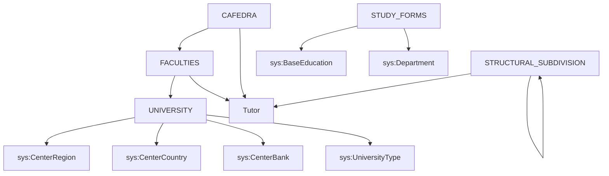

# RF_TFW-1.1 — Структура университета

> **Группа:** Базовая организационная структура вуза
> **Сущностей:** 5 | **Composite Key:** `FACULTY_ID_COMPOSITE_KEY`, `CAFEDRA_ID_COMPOSITE_KEY`, `UNIVERSITY_ID_COMPOSITE_KEY`

---

## 1. UNIVERSITY — Общие сведения о вузе

**typeCode:** `UNIVERSITY`
**Composite Key:** `UNIVERSITY_ID_COMPOSITE_KEY` → `{ type, id }`

| Поле | Тип | Обязательное | Описание |
|------|-----|:---:|----------|
| typeCode | string | ✅ | `"UNIVERSITY"` |
| universityId | int32 | ✅ | ID вуза в ЕПВО |
| id | int32 | ✅ | Уникальный идентификатор |
| nameRu | string | | Название вуза на русском |
| nameKz | string | | Название вуза на казахском |
| nameEn | string | | Название вуза на английском |
| shortNameRu | string | | Краткое название RU |
| shortNameKz | string | | Краткое название KZ |
| shortNameEn | string | | Краткое название EN |
| type | int32 | | Тип вуза (ссылка на `UniversityType`) |
| rector | int32 | | ID ректора (ссылка на Tutor) |
| address | string | | Адрес |
| phone | string | | Телефон |
| fax | string | | Факс |
| email | string | | Электронная почта |
| website | string | | Веб-сайт |
| bin | string | | БИН организации |
| bankId | int64 | | ID банка (ссылка на `CenterBank`) |
| account | string | | Расчётный счёт |
| kbeCode | string | | КБЕ-код |
| kbeCodePayment | string | | КБЕ-код платежа |
| kbeCodeGrant | string | | КБЕ-код гранта |
| regionId | int32 | | Регион (ссылка на `CenterRegion`) |
| countryId | int32 | | Страна (ссылка на `CenterCountry`) |
| created | date | | Дата создания вуза |
| satellite | int32 | | Точки спутникового интернета |
| proper | int32 | | Другие точки подключения |
| dialUp | int32 | | Точки интернета dial-up |
| informationRu | string | | Доп. информация RU |
| informationKz | string | | Доп. информация KZ |
| informationEn | string | | Доп. информация EN |

**FK-зависимости:** `CenterRegion`, `CenterCountry`, `CenterBank`, `UniversityType`, `Tutor`

**JSON-пример:**
```json
{
  "typeCode": "UNIVERSITY",
  "universityId": 999,
  "id": 1,
  "nameRu": "КазНПУ им. Абая",
  "nameKz": "Абай атындағы ҚазҰПУ",
  "nameEn": "Abai KazNPU",
  "type": 1,
  "regionId": 1,
  "countryId": 1
}
```

---

## 2. FACULTIES — Факультеты

**typeCode:** `FACULTIES`
**Composite Key:** `FACULTY_ID_COMPOSITE_KEY` → `{ type, facultyId }`

| Поле | Тип | Обязательное | Описание |
|------|-----|:---:|----------|
| typeCode | string | ✅ | `"FACULTIES"` |
| universityId | int32 | ✅ | ID вуза |
| facultyId | int32 | ✅ | Уникальный идентификатор факультета |
| facultyNameRu | string | | Название факультета на русском |
| facultyNameKz | string | | Название факультета на казахском |
| facultyNameEn | string | | Название факультета на английском |
| facultyDean | int32 | | Декан факультета (ID преподавателя → Tutor) |
| created | date | | Дата создания факультета (`yyyy-MM-dd`) |
| informationRu | string | | Информация о факультете RU |
| informationEn | string | | Информация о факультете EN |
| informationKz | string | | Информация о факультете KZ |
| satellite | int32 | | Точки спутникового интернета |
| proper | int32 | | Другие точки подключения |
| dialUp | int32 | | Точки интернета |

**FK-зависимости:** `Tutor` (facultyDean)

**JSON-пример:**
```json
{
  "typeCode": "FACULTIES",
  "universityId": 999,
  "facultyId": 101,
  "facultyNameRu": "Педагогический факультет",
  "facultyNameKz": "Педагогикалық факультет",
  "facultyNameEn": "Faculty of Education",
  "facultyDean": 5001,
  "created": "2000-01-01"
}
```

---

## 3. CAFEDRA — Кафедры

**typeCode:** `CAFEDRA`
**Composite Key:** `CAFEDRA_ID_COMPOSITE_KEY` → `{ type, cafedraId }`

| Поле | Тип | Обязательное | Описание |
|------|-----|:---:|----------|
| typeCode | string | ✅ | `"CAFEDRA"` |
| universityId | int32 | ✅ | ID вуза |
| cafedraId | int32 | ✅ | Уникальный идентификатор кафедры |
| cafedraNameRu | string | | Название кафедры на русском |
| cafedraNameKz | string | | Название кафедры на казахском |
| cafedraNameEn | string | | Название кафедры на английском |
| facultyId | int32 | | ID факультета (→ FACULTIES) |
| created | date | | Дата открытия кафедры (`yyyy-MM-dd`) |
| cafedraManager | int32 | | Руководитель кафедры (ID → Tutor) |
| informationRu | string | | Доп. информация RU |
| informationEn | string | | Доп. информация EN |
| informationKz | string | | Доп. информация KZ |

**FK-зависимости:** `Faculties` (facultyId), `Tutor` (cafedraManager)

**JSON-пример:**
```json
{
  "typeCode": "CAFEDRA",
  "universityId": 999,
  "cafedraId": 201,
  "cafedraNameRu": "Кафедра информатики",
  "cafedraNameKz": "Информатика кафедрасы",
  "cafedraNameEn": "Department of Computer Science",
  "facultyId": 101,
  "cafedraManager": 5010,
  "created": "2005-09-01"
}
```

---

## 4. STRUCTURAL_SUBDIVISION — Структурные подразделения

**typeCode:** `STRUCTURAL_SUBDIVISION`
**Composite Key:** `UNIVERSITY_ID_COMPOSITE_KEY` → `{ type, id }`

| Поле | Тип | Обязательное | Описание |
|------|-----|:---:|----------|
| typeCode | string | ✅ | `"STRUCTURAL_SUBDIVISION"` |
| universityId | int32 | ✅ | ID вуза |
| id | int32 | ✅ | Уникальный идентификатор подразделения |
| nameRu | string | | Название подразделения на русском |
| nameKz | string | | Название подразделения на казахском |
| nameEn | string | | Название подразделения на английском |
| parentId | int32 | | ID родительского подразделения (иерархия) |
| headId | int32 | | ID руководителя (→ Tutor) |
| created | date | | Дата создания |

**FK-зависимости:** `Tutor` (headId), `StructuralSubdivision` (parentId, рекурсия)

**JSON-пример:**
```json
{
  "typeCode": "STRUCTURAL_SUBDIVISION",
  "universityId": 999,
  "id": 301,
  "nameRu": "Учебно-методическое управление",
  "nameKz": "Оқу-әдістемелік басқарма",
  "nameEn": "Academic Affairs Department",
  "parentId": null,
  "headId": 5020
}
```

---

## 5. STUDY_FORMS — Формы обучения

**typeCode:** `STUDY_FORMS`
**Composite Key:** `UNIVERSITY_ID_COMPOSITE_KEY` → `{ type, id }`

| Поле | Тип | Обязательное | Описание |
|------|-----|:---:|----------|
| typeCode | string | ✅ | `"STUDY_FORMS"` |
| universityId | int32 | ✅ | ID вуза |
| id | int32 | ✅ | Уникальный идентификатор формы обучения |
| nameRu | string | | Название формы обучения на русском |
| nameKz | string | | Название формы обучения на казахском |
| nameEn | string | | Название формы обучения на английском |
| baseEducationId | int32 | | Базовое образование (→ `BaseEducation`) |
| departmentId | int32 | | Отделение (→ `Department`) |

**FK-зависимости:** `BaseEducation`, `Department`

**JSON-пример:**
```json
{
  "typeCode": "STUDY_FORMS",
  "universityId": 999,
  "id": 1,
  "nameRu": "Очная",
  "nameKz": "Күндізгі",
  "nameEn": "Full-time",
  "baseEducationId": 1,
  "departmentId": 1
}
```

---

## Граф зависимостей группы



---

## ❓ Поля с неясным описанием (для уточнения у Platonus)

В данной группе **нет** полей с пустым описанием (`"----"`).

---

*Создано: 2026-02-19 | Источник: OpenAPI spec v0 (epvo.kz)*
