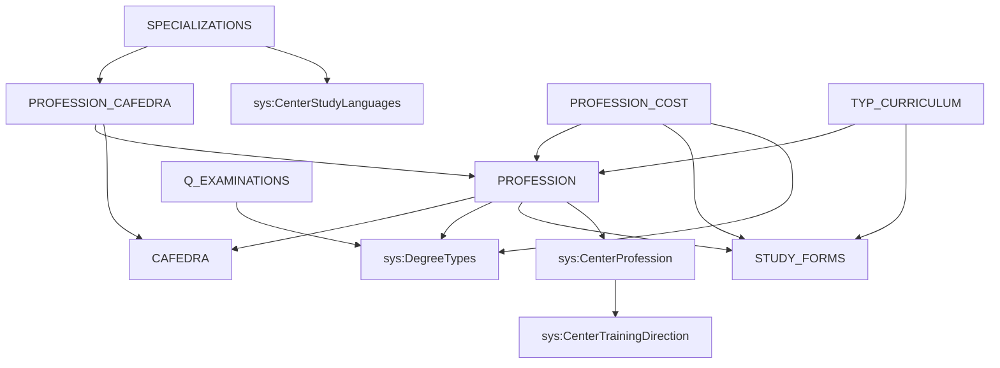

# RF_TFW-1.2 — Образовательные программы и специальности

> **Группа:** ОП, специальности, ГОП, учебные планы
> **Сущностей:** 7 | **Composite Key:** `PROFESSION_ID_COMPOSITE_KEY`, `CURRICULUM_ID_COMPOSITE_KEY`, `UNIVERSITY_ID_COMPOSITE_KEY`

---

## 1. PROFESSION — Группы образовательных программ (ГОП)

**typeCode:** `PROFESSION`
**Composite Key:** `PROFESSION_ID_COMPOSITE_KEY` → `{ type, professionId }`

| Поле | Тип | Обязательное | Описание |
|------|-----|:---:|----------|
| typeCode | string | ✅ | `"PROFESSION"` |
| universityId | int32 | ✅ | ID вуза |
| professionId | int32 | ✅ | Уникальный идентификатор ГОП |
| professionCode | string | | Код ГОП |
| professionNameRu | string | | Название ГОП на русском |
| professionNameKz | string | | Название ГОП на казахском |
| professionNameEn | string | | Название ГОП на английском |
| cafedraId | int32 | | Кафедра, за которой закреплена ГОП (→ Cafedra) |
| degreeTypeId | int32 | | Академическая степень (→ `DegreeTypes`) |
| studyFormId | int32 | | Форма обучения (→ StudyForms) |
| centerProfId | int64 | | ID из центрального справочника (→ `CenterProfession`) |
| accredited | boolean | | Аккредитована ли ГОП |
| studyPeriod | int32 | | Срок обучения (в семестрах) |
| created | date | | Дата создания |
| trainingDirectionsId | int32 | | Направление подготовки (→ `CenterTrainingDirection`) |

**FK-зависимости:** `Cafedra`, `DegreeTypes`, `StudyForms`, `CenterProfession`, `CenterTrainingDirection`

**JSON-пример:**
```json
{
  "typeCode": "PROFESSION",
  "universityId": 999,
  "professionId": 401,
  "professionCode": "6B01",
  "professionNameRu": "Педагогические науки",
  "professionNameKz": "Педагогика ғылымдары",
  "professionNameEn": "Pedagogical Sciences",
  "cafedraId": 201,
  "degreeTypeId": 1,
  "studyFormId": 1,
  "centerProfId": 100500,
  "accredited": true,
  "studyPeriod": 8
}
```

---

## 2. SPECIALIZATIONS — Образовательные программы (ОП)

**typeCode:** `SPECIALIZATIONS`
**Composite Key:** `UNIVERSITY_ID_COMPOSITE_KEY` → `{ type, id }`

| Поле | Тип | Обязательное | Описание |
|------|-----|:---:|----------|
| typeCode | string | ✅ | `"SPECIALIZATIONS"` |
| universityId | int32 | ✅ | ID вуза |
| id | int32 | ✅ | Уникальный идентификатор ОП |
| prof_caf_id | int32 | | ID мостовой связи (→ `PROFESSION_CAFEDRA`). ⚠️ OpenAPI v3 ошибочно документирует прямую fk `professionId`. *(Исправлено: TD-22)* |
| nameRu | string | | Название ОП на русском |
| nameKz | string | | Название ОП на казахском |
| nameEn | string | | Название ОП на английском |
| code | string | | Код ОП (внутренний) |
| specializationCode | string | | Код ОП для реестра (формат: код_напр + порядковый_номер) |
| accredited | boolean | | Аккредитована ли ОП |
| studyLanguageId | int32 | | Язык обучения (→ `CenterStudyLanguages`) |
| statusep | int32 | | Статус в Реестре (0=Не вкл, 1=Вкл, 2=Искл) |
| eduprogtype | int32 | | Тип ОП (1=Действ, 2=Новая, 3=Инновац) |
| ignore_rms | boolean | | Исключить из расчета показателей СУР |
| trainingformatid | int32 | | Формат обучения (→ `CenterTrainingFormat`) |
| is_interdisciplinary | boolean | | Междисциплинарная ОП |
| doublediploma | boolean | | Двудипломное образование |
| jointep | boolean | | Совместная ОП |
| partneruniverid | int32 | | ID партнёрского вуза |
| descriptionRu/Kz/En | string | | Описание ОП (до 4096 символов) |

*(Примечание: Дополнительные 20+ полей добавлены в рамках TFW-10 для соответствия adm_doc. OpenAPI spec является неполным. TD-21)*

**FK-зависимости:** `PROFESSION_CAFEDRA` (prof_caf_id), `CenterStudyLanguages`, `CenterTrainingFormat`

**JSON-пример:**
```json
{
  "typeCode": "SPECIALIZATIONS",
  "universityId": 999,
  "id": 501,
  "prof_caf_id": 1,
  "nameRu": "Информатика",
  "nameKz": "Информатика",
  "nameEn": "Computer Science",
  "code": "6B01501",
  "specializationCode": "6B01501",
  "accredited": true,
  "studyLanguageId": 1,
  "statusep": 1,
  "ignore_rms": false
}
```

---

## 3. PROFESSION_CAFEDRA — Привязка ГОП к кафедрам

**typeCode:** `PROFESSION_CAFEDRA`
**Composite Key:** `UNIVERSITY_ID_COMPOSITE_KEY` → `{ type, id }`

| Поле | Тип | Обязательное | Описание |
|------|-----|:---:|----------|
| typeCode | string | ✅ | `"PROFESSION_CAFEDRA"` |
| universityId | int32 | ✅ | ID вуза |
| id | int32 | ✅ | Уникальный идентификатор связи |
| professionId | int32 | | ID ГОП (→ Profession) |
| cafedraId | int32 | | ID кафедры (→ Cafedra) |

**FK-зависимости:** `Profession`, `Cafedra`

**JSON-пример:**
```json
{
  "typeCode": "PROFESSION_CAFEDRA",
  "universityId": 999,
  "id": 1,
  "professionId": 401,
  "cafedraId": 201
}
```

---

## 4. PROFESSION_COST — Стоимость обучения по ГОП

**typeCode:** `PROFESSION_COST`
**Composite Key:** `PROFESSION_COST_ID_COMPOSITE_KEY` → `{ type, costId }`

| Поле | Тип | Обязательное | Описание |
|------|-----|:---:|----------|
| typeCode | string | ✅ | `"PROFESSION_COST"` |
| universityId | int32 | ✅ | ID вуза |
| costId | int32 | ✅ | Уникальный идентификатор стоимости |
| professionId | int32 | | ID ГОП (→ Profession) |
| studyFormId | int32 | | Форма обучения (→ StudyForms) |
| degreeTypeId | int32 | | Академическая степень (→ `DegreeTypes`) |
| year | int32 | | Учебный год |
| cost | double | | Стоимость обучения |
| currency | string | | Валюта |

**FK-зависимости:** `Profession`, `StudyForms`, `DegreeTypes`

**JSON-пример:**
```json
{
  "typeCode": "PROFESSION_COST",
  "universityId": 999,
  "costId": 1,
  "professionId": 401,
  "studyFormId": 1,
  "degreeTypeId": 1,
  "year": 2025,
  "cost": 1200000.0,
  "currency": "KZT"
}
```

---

## 5. EDUCATION_PROGRAMS_CODE — Коды аккредитованных ОП

**typeCode:** `EDUCATION_PROGRAMS_CODE`
**Composite Key:** `UNIVERSITY_ID_COMPOSITE_KEY` → `{ type, id }`

| Поле | Тип | Обязательное | Описание |
|------|-----|:---:|----------|
| typeCode | string | ✅ | `"EDUCATION_PROGRAMS_CODE"` |
| universityId | int32 | ✅ | ID вуза |
| id | int32 | ✅ | Уникальный идентификатор записи |
| codeName | string | | Код образовательной программы |
| nameRu | string | | Название ОП на русском |
| nameEn | string | | Название ОП на английском |
| nameKz | string | | Название ОП на казахском |

**FK-зависимости:** нет

**JSON-пример:**
```json
{
  "typeCode": "EDUCATION_PROGRAMS_CODE",
  "universityId": 999,
  "id": 1,
  "codeName": "6B01501",
  "nameRu": "Информатика",
  "nameKz": "Информатика",
  "nameEn": "Computer Science"
}
```

---

## 6. TYP_CURRICULUM — Типовые учебные планы

**typeCode:** `TYP_CURRICULUM`
**Composite Key:** `CURRICULUM_ID_COMPOSITE_KEY` → `{ type, curriculumId }`

| Поле | Тип | Обязательное | Описание |
|------|-----|:---:|----------|
| typeCode | string | ✅ | `"TYP_CURRICULUM"` |
| universityId | int32 | ✅ | ID вуза |
| curriculumId | int32 | ✅ | Уникальный идентификатор учебного плана |
| professionId | int32 | | ID ГОП (→ Profession) |
| studyFormId | int32 | | Форма обучения (→ StudyForms) |
| year | int32 | | Учебный год |
| nameRu | string | | Название плана RU |
| nameKz | string | | Название плана KZ |
| nameEn | string | | Название плана EN |
| approved | boolean | | Утверждён |
| approvalDate | date | | Дата утверждения |

**FK-зависимости:** `Profession`, `StudyForms`

**JSON-пример:**
```json
{
  "typeCode": "TYP_CURRICULUM",
  "universityId": 999,
  "curriculumId": 1,
  "professionId": 401,
  "studyFormId": 1,
  "year": 2025,
  "nameRu": "ТУП Информатика 2025",
  "approved": true,
  "approvalDate": "2025-06-01"
}
```

---

## 7. Q_EXAMINATIONS — Типы государственной аттестации

**typeCode:** `Q_EXAMINATIONS`
**Composite Key:** `EXAM_ID_COMPOSITE_KEY` → `{ type, examId }`

| Поле | Тип | Обязательное | Описание |
|------|-----|:---:|----------|
| typeCode | string | ✅ | `"Q_EXAMINATIONS"` |
| universityId | int32 | ✅ | ID вуза |
| examId | int32 | ✅ | ID типа аттестации |
| degreeTypeId | int32 | | Академическая степень (→ `DegreeTypes`) |
| needName | boolean | | Требуется ли ввод названия работы |
| nameRu | string | | Название на русском |
| nameKz | string | | Название на казахском |
| nameEn | string | | Название на английском |
| chairman | double | | Председатель |
| member | double | | Член комиссии |
| secretary | double | | Секретарь |

**FK-зависимости:** `DegreeTypes`

**JSON-пример:**
```json
{
  "typeCode": "Q_EXAMINATIONS",
  "universityId": 999,
  "examId": 1,
  "degreeTypeId": 1,
  "needName": true,
  "nameRu": "Защита дипломной работы",
  "nameKz": "Дипломдық жұмысты қорғау",
  "nameEn": "Diploma defense"
}
```

---

## Граф зависимостей группы



---

## ❓ Поля с неясным описанием (для уточнения у Platonus)

В данной группе **нет** полей с пустым описанием.

---

*Создано: 2026-02-19 | Источник: OpenAPI spec v0 (epvo.kz)*
