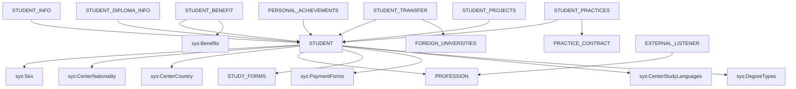

# RF_TFW-1.3 — Обучающиеся (Студенты)

> **Группа:** Контингент обучающихся, персональные данные, дипломная информация
> **Сущностей:** 10 | **Composite Key:** `STUDENT_ID_COMPOSITE_KEY`, `EXTERNAL_LISTENER_ID_COMPOSITE_KEY`, `ROW_NUMBER_FOR_PK_COMPOSITE_KEY`, `UNIVERSITY_ID_COMPOSITE_KEY`

---

## 1. STUDENT — Основные данные обучающегося

**typeCode:** `STUDENT`
**Composite Key:** `STUDENT_ID_COMPOSITE_KEY` → `{ type, studentId }`

| Поле | Тип | Обязательное | Описание |
|------|-----|:---:|----------|
| typeCode | string | ✅ | `"STUDENT"` |
| universityId | int32 | ✅ | ID вуза |
| studentId | int32 | ✅ (not null) | Уникальный идентификатор обучающегося |
| firstName | string | ✅ (not null) | Имя |
| lastName | string | ✅ (not null) | Фамилия |
| patronymic | string | | Отчество |
| birthDate | date | ✅ (not null) | Дата рождения (`yyyy-MM-dd`) |
| genderId | int32 | ✅ (not null) | Пол (→ `Sex`) |
| iin | string | | ИИН обучающегося |
| nationId | int32 | ✅ (not null) | Национальность (→ `CenterNationality`) |
| sitizenshipId | int32 | ✅ (not null) | Гражданство (→ `CenterCountry`) |
| professionId | int32 | ✅ (not null) | ГОП (→ Profession) |
| studyFormId | int32 | ✅ (not null) | Форма обучения (→ StudyForms) |
| paymentFormId | int32 | ✅ (not null) | Форма оплаты (→ `PaymentForms`) |
| studyLanguageId | int32 | ✅ (not null) | Язык обучения (→ `CenterStudyLanguages`) |
| degreeId | int32 | ✅ (not null) | Академическая степень (→ `DegreeTypes`) |
| courseNumber | int32 | ✅ (not null) | Номер курса |
| enrollDate | date | ✅ (not null) | Дата зачисления (`yyyy-MM-dd`) |
| enrollYear | int32 | | Год поступления |
| status | int32 | ✅ (not null) | Статус (1-обучается, 2-абитуриент, 3-отчислен, 4-выпускник) |
| gpa | double | | GPA |
| maritalStateId | int32 | | Семейное положение (→ `MaritalStates`) |
| residenceStateId | int32 | | Место проживания (→ `ResidenceState`) |
| dormStateId | int32 | | Статус общежития (→ `DormStates`) |
| disabilityCategoryId | int32 | | Категория инвалидности (→ `DisabilityCategories`) |
| specializationId | int32 | | ОП (→ Specializations) |
| centerProfChecked | boolean | ✅ (not null) | Проверена ли привязка к центр. справочнику ГОП |
| grantTypeId | int32 | | Вид гранта (→ `GrantTypes`) |
| identDocTypeId | int32 | | Тип удост. личности (→ `ICType`) |
| identDocNumber | string | | Номер документа |
| identDocDate | date | | Дата выдачи документа |
| identDocOrgId | int32 | | Орган выдачи (→ `IcDepartment`) |
| phone | string | | Телефон |
| address | string | | Адрес |
| noCheckIin | boolean | | Не проверять ИИН |
| noLastName | boolean | | Без фамилии |
| modified | datetime | | Дата изменения |

**FK-зависимости:** `Sex`, `CenterNationality`, `CenterCountry`, `Profession`, `StudyForms`, `PaymentForms`, `CenterStudyLanguages`, `DegreeTypes`, `MaritalStates`, `ResidenceState`, `DormStates`, `DisabilityCategories`, `Specializations`, `GrantTypes`, `ICType`, `IcDepartment`

**JSON-пример:**
```json
{
  "typeCode": "STUDENT",
  "universityId": 999,
  "studentId": 10001,
  "firstName": "Айдана",
  "lastName": "Сатпаева",
  "birthDate": "2003-05-15",
  "genderId": 2,
  "iin": "030515500123",
  "nationId": 1,
  "sitizenshipId": 1,
  "professionId": 401,
  "studyFormId": 1,
  "paymentFormId": 1,
  "studyLanguageId": 1,
  "degreeId": 1,
  "courseNumber": 3,
  "enrollDate": "2021-09-01",
  "status": 1,
  "centerProfChecked": true
}
```

---

## 2. STUDENT_INFO — Дополнительная информация об обучающемся

**typeCode:** `STUDENT_INFO`
**Composite Key:** `STUDENT_ID_COMPOSITE_KEY` → `{ type, studentId }`

| Поле | Тип | Обязательное | Описание |
|------|-----|:---:|----------|
| typeCode | string | ✅ | `"STUDENT_INFO"` |
| universityId | int32 | ✅ | ID вуза |
| studentId | int32 | ✅ | ID обучающегося (→ Student) |
| schoolId | int32 | | Школа, которую окончил (→ `Institution`) |
| entScore | int32 | | Баллы ЕНТ |
| schoolCertNumber | string | | Номер аттестата |
| schoolCertDate | date | | Дата выдачи аттестата |
| diplomaNumber | string | | Номер диплома |
| diplomaSeries | string | | Серия диплома |
| diplomaDate | date | | Дата выдачи диплома |
| entranceExamLangId | int32 | | Язык вступительного экзамена (→ `EntranceExamLanguage`) |
| educationConditionId | int32 | | Условия обучения (→ `EducationConditions`) |

**FK-зависимости:** `Student`, `Institution`, `EntranceExamLanguage`, `EducationConditions`

---

## 3. STUDENT_DIPLOMA_INFO — Дипломная информация выпускника

**typeCode:** `STUDENT_DIPLOMA_INFO`
**Composite Key:** `STUDENT_ID_COMPOSITE_KEY` → `{ type, studentId }`

| Поле | Тип | Обязательное | Описание |
|------|-----|:---:|----------|
| typeCode | string | ✅ | `"STUDENT_DIPLOMA_INFO"` |
| universityId | int32 | ✅ | ID вуза |
| studentId | int32 | ✅ | ID обучающегося (→ Student) |
| diplomaNumber | string | | Номер диплома |
| diplomaSeries | string | | Серия диплома |
| diplomaDate | date | | Дата выдачи |
| registrationNumber | string | | Регистрационный номер |
| honor | boolean | | Диплом с отличием |
| iacProtocol | string | | Протокол ГАК/ГЭК |

---

## 4. STUDENT_BENEFIT — Льготы обучающихся

**typeCode:** `STUDENT_BENEFIT`
**Composite Key:** `UNIVERSITY_ID_COMPOSITE_KEY` → `{ type, id }`

| Поле | Тип | Обязательное | Описание |
|------|-----|:---:|----------|
| typeCode | string | ✅ | `"STUDENT_BENEFIT"` |
| universityId | int32 | ✅ | ID вуза |
| id | int32 | ✅ | Уникальный ID записи |
| studentId | int32 | | ID обучающегося (→ Student) |
| benefitId | int32 | | ID льготы (→ `Benefits`) |
| startDate | date | | Дата начала |
| endDate | date | | Дата окончания |

**FK-зависимости:** `Student`, `Benefits`

---

## 5. STUDENTS_ADMISSION_SUBJECTS — Вступительные предметы

**typeCode:** `STUDENTS_ADMISSION_SUBJECTS`
**Composite Key:** `UNIVERSITY_ID_COMPOSITE_KEY` → `{ type, id }`

| Поле | Тип | Обязательное | Описание |
|------|-----|:---:|----------|
| typeCode | string | ✅ | `"STUDENTS_ADMISSION_SUBJECTS"` |
| universityId | int32 | ✅ | ID вуза |
| id | int32 | ✅ | Уникальный ID записи |
| studentId | int32 | | ID обучающегося (→ Student) |
| subjectId | int32 | | ID предмета (→ `SubjectForAdmission`) |
| mark | double | | Балл |

**FK-зависимости:** `Student`, `SubjectForAdmission`

---

## 6. PERSONAL_ACHIEVEMENTS — Персональные достижения

**typeCode:** `PERSONAL_ACHIEVEMENTS`
**Composite Key:** `UNIVERSITY_ID_COMPOSITE_KEY` → `{ type, id }`

| Поле | Тип | Обязательное | Описание |
|------|-----|:---:|----------|
| typeCode | string | ✅ | `"PERSONAL_ACHIEVEMENTS"` |
| universityId | int32 | ✅ | ID вуза |
| id | int32 | ✅ | Уникальный ID записи |
| studentId | int32 | | ID обучающегося (→ Student) |
| nameRu | string | | Описание достижения RU |
| nameKz | string | | Описание достижения KZ |
| nameEn | string | | Описание достижения EN |
| date | date | | Дата достижения |

**FK-зависимости:** `Student`

---

## 7. STUDENT_TRANSFER — Академическая мобильность

**typeCode:** `STUDENT_TRANSFER`
**Composite Key:** `TRANSFER_ID_COMPOSITE_KEY` → `{ type, transferId }`

| Поле | Тип | Обязательное | Описание |
|------|-----|:---:|----------|
| typeCode | string | ✅ | `"STUDENT_TRANSFER"` |
| universityId | int32 | ✅ | ID вуза |
| transferId | int32 | ✅ | Уникальный ID перевода |
| studentId | int32 | | ID обучающегося (→ Student) |
| foreignUniversityId | int32 | | Зарубежный вуз (→ ForeignUniversities) |
| startDate | date | | Дата начала мобильности |
| finishDate | date | | Дата окончания |
| academicMobilityTypeId | int32 | | Тип мобильности (→ `AcademicMobilityType`) |
| financingSourceId | int32 | | Источник финансирования (→ FinancingSourceAcademicMobility) |
| programId | int32 | | Программа обмена (→ `CenterAcademicExchangeProgram`) |

**FK-зависимости:** `Student`, `ForeignUniversities`, `AcademicMobilityType`, `FinancingSourceAcademicMobility`, `CenterAcademicExchangeProgram`

---

## 8. STUDENT_PRACTICES — Практики обучающихся

**typeCode:** `STUDENT_PRACTICES`
**Composite Key:** `STUDENT_PRACTICE_ID_COMPOSITE_KEY` → `{ type, studentPracticeId }`

| Поле | Тип | Обязательное | Описание |
|------|-----|:---:|----------|
| typeCode | string | ✅ | `"STUDENT_PRACTICES"` |
| universityId | int32 | ✅ | ID вуза |
| studentPracticeId | int32 | ✅ | Уникальный ID практики |
| studentId | int32 | | ID обучающегося (→ Student) |
| practiceContractId | int32 | | ID договора практики (→ PracticeContract) |
| groupTypeId | int32 | | Тип группы/практики (→ GroupType) |
| startDate | date | | Дата начала |
| finishDate | date | | Дата окончания |
| course | int32 | | Курс |
| term | int32 | | Семестр |

**FK-зависимости:** `Student`, `PracticeContract`, `GroupType`

---

## 9. STUDENT_PROJECTS — Проекты обучающихся

**typeCode:** `STUDENT_PROJECTS`
**Composite Key:** `UNIVERSITY_ID_COMPOSITE_KEY` → `{ type, id }`

| Поле | Тип | Обязательное | Описание |
|------|-----|:---:|----------|
| typeCode | string | ✅ | `"STUDENT_PROJECTS"` |
| universityId | int32 | ✅ | ID вуза |
| id | int32 | ✅ | Уникальный ID записи |
| studentId | int32 | | ID обучающегося (→ Student) |
| projectName | string | | Название проекта |
| startDate | date | | Дата начала |
| endDate | date | | Дата окончания |
| status | string | | Статус проекта |

**FK-зависимости:** `Student`

---

## 10. EXTERNAL_LISTENER — Слушатели

**typeCode:** `EXTERNAL_LISTENER`
**Composite Key:** `EXTERNAL_LISTENER_ID_COMPOSITE_KEY` → `{ type, listenerId }`

| Поле | Тип | Обязательное | Описание |
|------|-----|:---:|----------|
| typeCode | string | ✅ | `"EXTERNAL_LISTENER"` |
| universityId | int32 | ✅ (not null) | ID вуза |
| listenerId | int32 | ✅ (not null) | ID слушателя |
| firstName | string | ✅ (not null) | Имя |
| lastName | string | ✅ (not null) | Фамилия |
| patronymic | string | | Отчество |
| birthDate | date | ✅ (not null) | Дата рождения |
| genderId | int32 | ✅ (not null) | Пол (→ `Sex`) |
| iin | string | | ИИН |
| studyLanguageId | int32 | ✅ (not null) | Язык обучения (→ `CenterStudyLanguages`) |
| professionId | int32 | ✅ (not null) | ГОП (→ Profession) |
| specializationId | int32 | | ОП (→ Specializations) |
| specializationCode | string | | Код ОП |
| specializationNameRu | string | | Название ОП RU |
| specializationNameKz | string | | Название ОП KZ |
| specializationNameEn | string | | Название ОП EN |
| mainUniversityId | int32 | | Основная ОВПО |
| diplomaNumber | string | | Номер документа об образовании |
| diplomaSeries | string | | Серия документа |
| type | int32 | | Тип: 1-пед.переподготовка, 2-магистратура |
| status | int32 | | Статус: 1-обуч, 2-абитуриент, 3-отчислен, 4-выпускник |
| noCheckIin | boolean | | Не проверять ИИН |
| noLastName | boolean | | Без фамилии |
| modified | datetime | | Дата изменения |
| enrollYear | int32 | | Год поступления |
| graduationYear | int32 | | Год выпуска |
| educationDocumentIssueDate | date | | Дата выдачи документа об образовании |

**FK-зависимости:** `Sex`, `CenterStudyLanguages`, `Profession`, `Specializations`

---

## Граф зависимостей группы



---

## ❓ Поля с неясным описанием (для уточнения у Platonus)

В данной группе **нет** полей с пустым описанием (`"----"`).

---

*Создано: 2026-02-19 | Источник: OpenAPI spec v0 (epvo.kz)*
