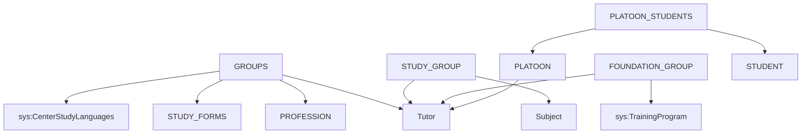

# RF_TFW-1.4 — Академические группы

> **Группа:** Группы, типы групп, учебные группы, взводы
> **Сущностей:** 6 | **Composite Key:** `GROUP_ID_COMPOSITE_KEY`, `GROUP_TYPE_ID_COMPOSITE_KEY`, `STUDY_GROUP_ID_COMPOSITE_KEY`, `STUDENT_STUDY_GROUP_ID_COMPOSITE_KEY`, `PLATOON_ID_COMPOSITE_KEY`

---

## 1. GROUPS — Академические группы

**typeCode:** `GROUPS`
**Composite Key:** `GROUP_ID_COMPOSITE_KEY` → `{ type, groupId }`

| Поле | Тип | Обязательное | Описание |
|------|-----|:---:|----------|
| typeCode | string | ✅ | `"GROUPS"` |
| universityId | int32 | ✅ | ID вуза |
| groupId | int32 | ✅ | Уникальный идентификатор группы |
| groupName | string | | Название группы |
| professionId | int32 | | ГОП (→ Profession) |
| studyFormId | int32 | | Форма обучения (→ StudyForms) |
| courseNumber | int32 | | Номер курса |
| year | int32 | | Учебный год |
| adviserId | int32 | | Куратор группы (→ Tutor) |
| studyLanguageId | int32 | | Язык обучения (→ `CenterStudyLanguages`) |
| degreeId | int32 | | Академическая степень (→ `DegreeTypes`) |

**FK-зависимости:** `Profession`, `StudyForms`, `Tutor`, `CenterStudyLanguages`, `DegreeTypes`

**JSON-пример:**
```json
{
  "typeCode": "GROUPS",
  "universityId": 999,
  "groupId": 601,
  "groupName": "ИНФ-31",
  "professionId": 401,
  "studyFormId": 1,
  "courseNumber": 3,
  "year": 2025,
  "adviserId": 5010,
  "studyLanguageId": 1,
  "degreeId": 1
}
```

---

## 2. GROUP_TYPE — Типы групп/практик

**typeCode:** `GROUP_TYPE`
**Composite Key:** `GROUP_TYPE_ID_COMPOSITE_KEY` → `{ type, groupTypeId }`

| Поле | Тип | Обязательное | Описание |
|------|-----|:---:|----------|
| typeCode | string | ✅ | `"GROUP_TYPE"` |
| universityId | int32 | ✅ | ID вуза |
| groupTypeId | int32 | ✅ | Уникальный идентификатор типа |
| nameRu | string | | Название типа RU |
| nameKz | string | | Название типа KZ |
| nameEn | string | | Название типа EN |

**FK-зависимости:** нет

---

## 3. STUDY_GROUP — Учебные группы (группы потоков)

**typeCode:** `STUDY_GROUP`
**Composite Key:** `STUDY_GROUP_ID_COMPOSITE_KEY` → `{ type, studyGroupId }`

| Поле | Тип | Обязательное | Описание |
|------|-----|:---:|----------|
| typeCode | string | ✅ | `"STUDY_GROUP"` |
| universityId | int32 | ✅ | ID вуза |
| studyGroupId | int32 | ✅ | Уникальный ID учебной группы |
| subjectId | int32 | | Дисциплина (→ Subject) |
| tutorId | int32 | | Преподаватель (→ Tutor) |
| year | int32 | | Учебный год |
| term | int32 | | Семестр |
| nameRu | string | | Название RU |

**FK-зависимости:** `Subject`, `Tutor`

---

## 4. FOUNDATION_GROUP — Группы подготовительного отделения

**typeCode:** `FOUNDATION_GROUP`
**Composite Key:** `UNIVERSITY_ID_COMPOSITE_KEY` → `{ type, id }`

| Поле | Тип | Обязательное | Описание |
|------|-----|:---:|----------|
| typeCode | string | ✅ | `"FOUNDATION_GROUP"` |
| universityId | int32 | ✅ | ID вуза |
| id | int32 | ✅ | Уникальный идентификатор |
| name | string | | Название группы |
| programId | int32 | | Программа подготовки (→ `TrainingProgram`) |
| adviserId | int32 | | Куратор (→ Tutor) |
| status | string | | Статус |
| createdDate | datetime | | Дата создания |
| lastModifiedDate | datetime | | Дата изменения |

**FK-зависимости:** `TrainingProgram`, `Tutor`

---

## 5. PLATOON — Взводы (военная кафедра)

**typeCode:** `PLATOON`
**Composite Key:** `PLATOON_ID_COMPOSITE_KEY` → `{ type, platoonId }`

| Поле | Тип | Обязательное | Описание |
|------|-----|:---:|----------|
| typeCode | string | ✅ | `"PLATOON"` |
| universityId | int32 | ✅ | ID вуза |
| platoonId | int32 | ✅ | Уникальный ID взвода |
| name | string | | Название взвода |
| year | int32 | | Учебный год |
| commanderId | int32 | | Командир (→ Tutor) |

**FK-зависимости:** `Tutor`

---

## 6. PLATOON_STUDENTS — Обучающиеся во взводах

**typeCode:** `PLATOON_STUDENTS`
**Composite Key:** `UNIVERSITY_ID_COMPOSITE_KEY` → `{ type, id }`

| Поле | Тип | Обязательное | Описание |
|------|-----|:---:|----------|
| typeCode | string | ✅ | `"PLATOON_STUDENTS"` |
| universityId | int32 | ✅ | ID вуза |
| id | int32 | ✅ | Уникальный ID записи |
| platoonId | int32 | | ID взвода (→ Platoon) |
| studentId | int32 | | ID обучающегося (→ Student) |

**FK-зависимости:** `Platoon`, `Student`

---

## Граф зависимостей группы



---

## ❓ Поля с неясным описанием

В данной группе **нет** полей с пустым описанием (`"----"`).

---

*Создано: 2026-02-19 | Источник: OpenAPI spec v0 (epvo.kz)*
