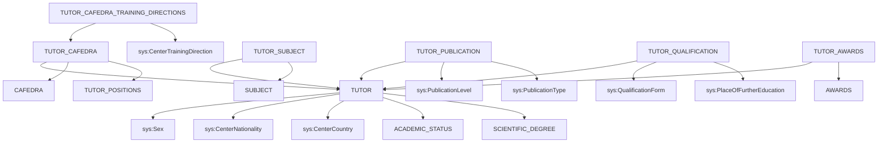

# RF_TFW-1.5 — Преподаватели (ППС)

> **Группа:** Преподаватели, кафедры ППС, квалификация, публикации, награды
> **Сущностей:** 8 | **Composite Key:** `TUTOR_ID_COMPOSITE_KEY`, `TUTOR_SUBJECT_ID_COMPOSITE_KEY`, `PUB_ID_COMPOSITE_KEY`, `QUAL_ID_COMPOSITE_KEY`, `UNIVERSITY_ID_COMPOSITE_KEY`

---

## 1. TUTOR — Преподаватели / сотрудники

**typeCode:** `TUTOR`
**Composite Key:** `TUTOR_ID_COMPOSITE_KEY` → `{ type, tutorId }`

| Поле | Тип | Обязательное | Описание |
|------|-----|:---:|----------|
| typeCode | string | ✅ | `"TUTOR"` |
| universityId | int32 | ✅ | ID вуза |
| tutorId | int32 | ✅ | Уникальный ID преподавателя |
| firstName | string | | Имя |
| lastName | string | | Фамилия |
| patronymic | string | | Отчество |
| birthDate | date | | Дата рождения (`yyyy-MM-dd`) |
| genderId | int32 | | Пол (→ `Sex`) |
| iin | string | | ИИН |
| nationId | int32 | | Национальность (→ `CenterNationality`) |
| sitizenshipId | int32 | | Гражданство (→ `CenterCountry`) |
| phone | string | | Телефон |
| email | string | | Электронная почта |
| address | string | | Адрес |
| academicStatusId | int32 | | Академический статус (→ AcademicStatus) |
| scientificDegreeId | int32 | | Учёная степень (→ ScientificDegree) |
| dateOfEmployment | date | | Дата приёма на работу |
| dateOfDismissal | date | | Дата увольнения |
| experience | int32 | | Общий стаж (лет) |
| pedagogicalExperience | int32 | | Педагогический стаж (лет) |
| identDocTypeId | int32 | | Тип документа (→ `ICType`) |
| identDocNumber | string | | Номер документа |
| identDocDate | date | | Дата выдачи |
| identDocOrgId | int32 | | Орган выдачи (→ `IcDepartment`) |

**FK-зависимости:** `Sex`, `CenterNationality`, `CenterCountry`, `AcademicStatus`, `ScientificDegree`, `ICType`, `IcDepartment`

**JSON-пример:**
```json
{
  "typeCode": "TUTOR",
  "universityId": 999,
  "tutorId": 5001,
  "firstName": "Серік",
  "lastName": "Ахметов",
  "birthDate": "1975-03-10",
  "genderId": 1,
  "iin": "750310300456",
  "nationId": 1,
  "sitizenshipId": 1,
  "academicStatusId": 1,
  "scientificDegreeId": 2,
  "dateOfEmployment": "2000-09-01"
}
```

---

## 2. TUTOR_CAFEDRA — Привязка преподавателя к кафедре

**typeCode:** `TUTOR_CAFEDRA`
**Composite Key:** `UNIVERSITY_ID_COMPOSITE_KEY` → `{ type, id }`

| Поле | Тип | Обязательное | Описание |
|------|-----|:---:|----------|
| typeCode | string | ✅ | `"TUTOR_CAFEDRA"` |
| universityId | int32 | ✅ | ID вуза |
| id | int32 | ✅ | Уникальный ID записи |
| tutorId | int32 | | ID преподавателя (→ Tutor) |
| cafedraId | int32 | | ID кафедры (→ Cafedra) |
| positionId | int32 | | Должность (→ TutorPositions) |
| rateValue | double | | Ставка |
| startDate | date | | Дата начала |
| endDate | date | | Дата окончания |
| isMainWork | boolean | | Основное место работы |
| isInternalPartTime | boolean | | Внутреннее совместительство |

**FK-зависимости:** `Tutor`, `Cafedra`, `TutorPositions`

---

## 3. TUTOR_CAFEDRA_TRAINING_DIRECTIONS — Направления подготовки кафедры ППС

**typeCode:** `TUTOR_CAFEDRA_TRAINING_DIRECTIONS`
**Composite Key:** `UNIVERSITY_ID_COMPOSITE_KEY` → `{ type, id }`

| Поле | Тип | Обязательное | Описание |
|------|-----|:---:|----------|
| typeCode | string | ✅ | `"TUTOR_CAFEDRA_TRAINING_DIRECTIONS"` |
| universityId | int32 | ✅ | ID вуза |
| id | int32 | ✅ | Уникальный ID записи |
| tutorCafedraId | int32 | | ID связи "преподаватель-кафедра" (→ TutorCafedra) |
| trainingDirectionId | int32 | | Направление подготовки (→ `CenterTrainingDirection`) |

**FK-зависимости:** `TutorCafedra`, `CenterTrainingDirection`

---

## 4. TUTOR_POSITIONS — Должности преподавателей

**typeCode:** `TUTOR_POSITIONS`
**Composite Key:** `UNIVERSITY_ID_COMPOSITE_KEY` → `{ type, id }`

| Поле | Тип | Обязательное | Описание |
|------|-----|:---:|----------|
| typeCode | string | ✅ | `"TUTOR_POSITIONS"` |
| universityId | int32 | ✅ | ID вуза |
| id | int32 | ✅ | Уникальный ID записи |
| nameRu | string | | Название должности RU |
| nameKz | string | | Название должности KZ |
| nameEn | string | | Название должности EN |
| isPps | boolean | | Является ли ППС |

**FK-зависимости:** нет

---

## 5. TUTOR_SUBJECT — Преподаватель-дисциплина (нагрузка)

**typeCode:** `TUTOR_SUBJECT`
**Composite Key:** `TUTOR_SUBJECT_ID_COMPOSITE_KEY` → `{ type, tutorSubjectId }`

| Поле | Тип | Обязательное | Описание |
|------|-----|:---:|----------|
| typeCode | string | ✅ | `"TUTOR_SUBJECT"` |
| universityId | int32 | ✅ | ID вуза |
| tutorSubjectId | int32 | ✅ | Уникальный ID записи |
| tutorId | int32 | | ID преподавателя (→ Tutor) |
| subjectId | int32 | | ID дисциплины (→ Subject) |
| year | int32 | | Учебный год |
| term | int32 | | Семестр |
| hours | int32 | | Количество часов |

**FK-зависимости:** `Tutor`, `Subject`

---

## 6. TUTOR_PUBLICATION — Публикации преподавателей

**typeCode:** `TUTOR_PUBLICATION`
**Composite Key:** `PUB_ID_COMPOSITE_KEY` → `{ type, pubId }`

| Поле | Тип | Обязательное | Описание |
|------|-----|:---:|----------|
| typeCode | string | ✅ | `"TUTOR_PUBLICATION"` |
| universityId | int32 | ✅ | ID вуза |
| pubId | int32 | ✅ | Уникальный ID публикации |
| tutorId | int32 | | ID преподавателя (→ Tutor) |
| title | string | | Название публикации |
| publicationLevelId | int32 | | Уровень публикации (→ `PublicationLevel`) |
| publicationTypeId | int32 | | Вид публикации (→ `PublicationType`) |
| publicationDate | date | | Дата публикации |
| journalName | string | | Название издания |
| doi | string | | DOI |
| url | string | | URL |
| impactFactor | double | | Импакт-фактор |
| coAuthors | string | | Соавторы |

**FK-зависимости:** `Tutor`, `PublicationLevel`, `PublicationType`

---

## 7. TUTOR_QUALIFICATION — Повышение квалификации

**typeCode:** `TUTOR_QUALIFICATION`
**Composite Key:** `QUAL_ID_COMPOSITE_KEY` → `{ type, qualId }`

| Поле | Тип | Обязательное | Описание |
|------|-----|:---:|----------|
| typeCode | string | ✅ | `"TUTOR_QUALIFICATION"` |
| universityId | int32 | ✅ | ID вуза |
| qualId | int32 | ✅ | Уникальный ID записи |
| tutorId | int32 | | ID преподавателя (→ Tutor) |
| formId | int32 | | Форма повышения квалификации (→ `QualificationForm`) |
| placeId | int32 | | База прохождения (→ `PlaceOfFurtherEducation`) |
| courseName | string | | Название курса |
| startDate | date | | Дата начала |
| finishDate | date | | Дата окончания |
| hours | int32 | | Количество часов |
| certificateNumber | string | | Номер сертификата |

**FK-зависимости:** `Tutor`, `QualificationForm`, `PlaceOfFurtherEducation`

---

## 8. TUTOR_AWARDS — Награды преподавателей

**typeCode:** `TUTOR_AWARDS`
**Composite Key:** `UNIVERSITY_ID_COMPOSITE_KEY` → `{ type, id }`

| Поле | Тип | Обязательное | Описание |
|------|-----|:---:|----------|
| typeCode | string | ✅ | `"TUTOR_AWARDS"` |
| universityId | int32 | ✅ | ID вуза |
| id | int32 | ✅ | Уникальный ID записи |
| tutorId | int32 | | ID преподавателя (→ Tutor) |
| awardId | int32 | | ID награды (→ Awards) |
| date | date | | Дата награждения |
| orderNumber | string | | Номер приказа |

**FK-зависимости:** `Tutor`, `Awards`

---

## Граф зависимостей группы



---

## ❓ Поля с неясным описанием

В данной группе **нет** полей с пустым описанием (`"----"`).

---

*Создано: 2026-02-19 | Источник: OpenAPI spec v0 (epvo.kz)*
