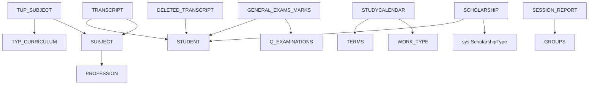

# RF_TFW-1.6 — Учебный процесс

> **Группа:** Дисциплины, транскрипты, учебные календари, виды работ, сессия
> **Сущностей:** 10 | **Composite Key:** `SUBJECT_ID_COMPOSITE_KEY`, `TUP_SUBJECT_ID_COMPOSITE_KEY`, `MARK_ID_COMPOSITE_KEY`, `STUDY_CALENDAR_ID_COMPOSITE_KEY`, `TERM_ID_COMPOSITE_KEY`, `WORK_TYPE_ID_COMPOSITE_KEY`, `REPORT_ID_COMPOSITE_KEY`

---

## 1. SUBJECT — Каталог дисциплин

**typeCode:** `SUBJECT`
**Composite Key:** `SUBJECT_ID_COMPOSITE_KEY` → `{ type, subjectId }`

| Поле | Тип | Обязательное | Описание |
|------|-----|:---:|----------|
| typeCode | string | ✅ | `"SUBJECT"` |
| universityId | int32 | ✅ | ID вуза |
| subjectId | int32 | ✅ | Уникальный ID дисциплины |
| nameRu | string | | Название дисциплины RU |
| nameKz | string | | Название дисциплины KZ |
| nameEn | string | | Название дисциплины EN |
| codeRu | string | | Код дисциплины RU |
| codeKz | string | | Код дисциплины KZ |
| codeEn | string | | Код дисциплины EN |
| credits | double | | Количество кредитов |
| ects | double | | Кредиты ECTS |
| professionId | int32 | | ГОП (→ Profession) |

**FK-зависимости:** `Profession`

**JSON-пример:**
```json
{
  "typeCode": "SUBJECT",
  "universityId": 999,
  "subjectId": 701,
  "nameRu": "Алгоритмы и структуры данных",
  "nameKz": "Алгоритмдер мен деректер құрылымдары",
  "nameEn": "Algorithms and Data Structures",
  "codeRu": "АСД",
  "credits": 5.0,
  "ects": 7.5,
  "professionId": 401
}
```

---

## 2. TUP_SUBJECT — Дисциплины в типовом учебном плане

**typeCode:** `TUP_SUBJECT`
**Composite Key:** `TUP_SUBJECT_ID_COMPOSITE_KEY` → `{ type, tupSubjectId }`

| Поле | Тип | Обязательное | Описание |
|------|-----|:---:|----------|
| typeCode | string | ✅ | `"TUP_SUBJECT"` |
| universityId | int32 | ✅ | ID вуза |
| tupSubjectId | int32 | ✅ | Уникальный ID записи |
| curriculumId | int32 | | ID учебного плана (→ TypCurriculum) |
| subjectId | int32 | | ID дисциплины (→ Subject) |
| courseNumber | int32 | | Номер курса |
| term | int32 | | Семестр |
| credits | double | | Кредиты |
| hours | int32 | | Часы |
| componentType | int32 | | Тип компонента |

**FK-зависимости:** `TypCurriculum`, `Subject`

---

## 3. TRANSCRIPT — Транскрипты текущих обучающихся

**typeCode:** `TRANSCRIPT`
**Composite Key:** `UNIVERSITY_ID_COMPOSITE_KEY` → `{ type, id }`

| Поле | Тип | Обязательное | Описание |
|------|-----|:---:|----------|
| typeCode | string | ✅ | `"TRANSCRIPT"` |
| universityId | int32 | ✅ | ID вуза |
| id | int32 | ✅ | Уникальный ID записи |
| studentId | int32 | | ID обучающегося (→ Student) |
| subjectId | int32 | | ID дисциплины (→ Subject) |
| subjectNameRu | string | | Название дисциплины RU |
| subjectNameKz | string | | Название дисциплины KZ |
| subjectNameEn | string | | Название дисциплины EN |
| codeRu | string | | Код дисциплины RU |
| codeEn | string | | Код дисциплины EN |
| subjectCode | string | | Код дисциплины KZ |
| credits | double | | Кредиты |
| ects | double | | Кредиты ECTS |
| courseNumber | int32 | | Курс |
| term | int32 | | Семестр |
| totalMark | double | | Итоговая оценка (%) |
| numeralMark | double | | Цифровая оценка |
| alphaMark | string | | Буквенная оценка |
| type | int32 | | Тип: 0-обычная, 1-практика, 5-зачёт, 6-исслед.работа, 32-без контроля |
| groupTypeId | int32 | | Тип практики (→ GroupType) |
| deleted | boolean | | Удалена |
| accepted | int32 | | Пройдена (1/0) |
| markId | int32 | | Уникальный номер оценки |
| isPassed | boolean | | Пройдено |
| wasRetaken | boolean | | Пройдена повторно |
| isGeneralExam | boolean | | Государственный экзамен |
| isAdditionalSubject | boolean | | Дополнительная дисциплина |
| isCoursework | boolean | | Курсовая работа |

**FK-зависимости:** `Student`, `Subject`, `GroupType`

---

## 4. DELETED_TRANSCRIPT — Транскрипты выпускников (архивные)

**typeCode:** `DELETED_TRANSCRIPT`
**Composite Key:** `UNIVERSITY_ID_COMPOSITE_KEY` → `{ type, id }`

> ⚠️ Несмотря на название «deleted», это **архивные** транскрипты **выпускников**, а не удалённые записи.

| Поле | Тип | Обязательное | Описание |
|------|-----|:---:|----------|
| typeCode | string | ✅ (not null) | `"DELETED_TRANSCRIPT"` |
| universityId | int32 | ✅ (not null) | ID вуза |
| id | int32 | ✅ (not null) | Уникальный ID записи |
| studentId | int32 | ✅ (not null) | ID обучающегося (→ Student/Graduates) |
| subjectNameRu | string | ✅ (not null) | Название дисциплины RU |
| subjectNameKz | string | ✅ (not null) | Название дисциплины KZ |
| subjectNameEn | string | ✅ (not null) | Название дисциплины EN |
| codeRu | string | ✅ (not null) | Код дисциплины RU |
| codeEn | string | ✅ (not null) | Код дисциплины EN |
| subjectCode | string | ✅ (not null) | Код дисциплины KZ |
| credits | double | ✅ (not null) | Кредиты |
| ects | double | | Коэффициент ECTS |
| courseNumber | int32 | ✅ (not null) | Курс |
| term | int32 | ✅ (not null) | Семестр |
| totalMark | double | ✅ (not null) | Итоговая оценка (%) |
| numeralMark | double | ✅ (not null) | Цифровая оценка |
| alphaMark | string | ✅ (not null) | Буквенная оценка |
| type | int32 | ✅ (not null) | Тип (см. Transcript) |
| groupTypeId | int32 | | Тип практики |
| deleted | boolean | | Удалена |
| accepted | int32 | | Пройдена |
| markId | int32 | | Уникальный номер оценки |
| hash | string | | ID оценки за гос. экзамен |
| isPassed | boolean | | Пройдено |
| wasRetaken | boolean | | Пройдена повторно |
| notIncludedScholarship | boolean | | Не учитывать при стипендии |
| isGeneralExam | boolean | | Государственный экзамен |
| isAdditionalSubject | boolean | | Дополнительная дисциплина |
| isCoursework | boolean | | Курсовая работа |
| isSubjectWithAdditionalType | boolean | | Дисциплина с доп. типом |
| subjectId | int32 | | ID дисциплины из каталога |

---

## 5. GENERAL_EXAMS_MARKS — Оценки по гос. аттестации

**typeCode:** `GENERAL_EXAMS_MARKS`
**Composite Key:** `MARK_ID_COMPOSITE_KEY` → `{ type, markId }`

| Поле | Тип | Обязательное | Описание |
|------|-----|:---:|----------|
| typeCode | string | ✅ | `"GENERAL_EXAMS_MARKS"` |
| universityId | int32 | ✅ | ID вуза |
| markId | int32 | ✅ | Уникальный ID оценки |
| studentId | int32 | | ID обучающегося (→ Student) |
| examId | int32 | | Тип гос. аттестации (→ QExaminations) |
| examDate | date | | Дата оценки |
| mark | double | | Оценка в баллах |
| apMark | double | | Оценка с апелляцией |
| credits | double | | Кредиты |
| course | int32 | | Курс |
| term | int32 | | Семестр |
| reportId | int32 | | ID ведомости гос. аттестации — ссылка на протокол, в рамках которого выставлена оценка |
| name | string | | Название аттестации RU |
| nameRu | string | | Название RU |
| nameKz | string | | Название KZ |
| nameEn | string | | Название EN |
| sacDate | date | | Дата протокола ГЭК/ГАК |
| sacNumber | string | | Номер протокола |
| success | int32 | | Отображать в транскрипте (0/1) |
| year | int32 | | Учебный год |
| accepted | boolean | | Подтверждена |
| nameWorkRu | string | | Название дипломной работы RU |
| nameWorkKz | string | | Название дипломной работы KZ |
| nameWorkEn | string | | Название дипломной работы EN |
| ects | double | | Кредиты ECTS (по аналогии с Transcript.ects; 1 KZ credit ≈ 1.5 ECTS) |
| current | boolean | | Текущая |
| typeId | int32 | | ID типа гос. аттестации |

**FK-зависимости:** `Student`, `QExaminations`

---

## 6. TERMS — Семестры / учебные периоды

**typeCode:** `TERMS`
**Composite Key:** `TERM_ID_COMPOSITE_KEY` → `{ type, termid }`

| Поле | Тип | Обязательное | Описание |
|------|-----|:---:|----------|
| typeCode | string | ✅ | `"TERMS"` |
| universityId | int32 | ✅ | ID вуза |
| termid | int64 | ✅ | Уникальный ID семестра |
| year | int32 | | Учебный год |
| term | int32 | | Номер семестра |
| startDate | date | | Дата начала |
| finishDate | date | | Дата окончания |

**FK-зависимости:** нет

---

## 7. STUDYCALENDAR — Учебный календарь

**typeCode:** `STUDYCALENDAR`
**Composite Key:** `STUDY_CALENDAR_ID_COMPOSITE_KEY` → `{ type, studyCalendarId }`

| Поле | Тип | Обязательное | Описание |
|------|-----|:---:|----------|
| typeCode | string | ✅ | `"STUDYCALENDAR"` |
| universityId | int32 | ✅ | ID вуза |
| studyCalendarId | int64 | ✅ | Уникальный ID записи |
| termId | int64 | | ID семестра (→ Terms) |
| weekNumber | int32 | | Номер недели |
| startDate | date | | Дата начала недели |
| endDate | date | | Дата окончания недели |
| workTypeId | int64 | | Тип работы (→ WorkType) |

**FK-зависимости:** `Terms`, `WorkType`

---

## 8. WORK_TYPE — Виды учебной работы

**typeCode:** `WORK_TYPE`
**Composite Key:** `WORK_TYPE_ID_COMPOSITE_KEY` → `{ type, id }`

| Поле | Тип | Обязательное | Описание |
|------|-----|:---:|----------|
| typeCode | string | ✅ | `"WORK_TYPE"` |
| universityId | int32 | ✅ | ID вуза |
| id | int64 | ✅ | Уникальный ID типа работы |
| nameRu | string | | Название RU |
| nameKz | string | | Название KZ |
| nameEn | string | | Название EN |
| color | string | | Цвет (для визуализации) |

**FK-зависимости:** нет

---

## 9. SESSION_REPORT — Отчёты по сессиям

**typeCode:** `SESSION_REPORT`
**Composite Key:** `REPORT_ID_COMPOSITE_KEY` → `{ type, reportId }`

| Поле | Тип | Обязательное | Описание |
|------|-----|:---:|----------|
| typeCode | string | ✅ | `"SESSION_REPORT"` |
| universityId | int32 | ✅ | ID вуза |
| reportId | int32 | ✅ | Уникальный ID отчёта |
| year | int32 | | Учебный год |
| term | int32 | | Семестр |
| groupId | int32 | | ID группы (→ Groups) |
| professionId | int32 | | ГОП (→ Profession) |
| totalStudents | int32 | | Всего обучающихся |
| passed | int32 | | Сдали |
| failed | int32 | | Не сдали |

**FK-зависимости:** `Groups`, `Profession`

---

## 10. SCHOLARSHIP — Стипендии

**typeCode:** `SCHOLARSHIP`
**Composite Key:** `UNIVERSITY_ID_COMPOSITE_KEY` → `{ type, id }`

| Поле | Тип | Обязательное | Описание |
|------|-----|:---:|----------|
| typeCode | string | ✅ | `"SCHOLARSHIP"` |
| universityId | int32 | ✅ | ID вуза |
| id | int32 | ✅ | Уникальный ID записи |
| studentId | int32 | | ID обучающегося (→ Student) |
| scholarshipTypeId | int32 | | Тип стипендии (→ `ScholarshipType`) |
| startDate | date | | Дата начала |
| endDate | date | | Дата окончания |
| terminationReasonId | int32 | | Причина прекращения (→ `ScholarshipTermination`) |
| amount | double | | Сумма |

**FK-зависимости:** `Student`, `ScholarshipType`, `ScholarshipTermination`

---

## Граф зависимостей группы



---

## ✅ Поля с неясным описанием (заполнены выводами)

| Сущность | Поле | Наш вывод |
|----------|------|----------|
| GENERAL_EXAMS_MARKS | reportId | ID ведомости гос. аттестации (протокол ГАК) |
| GENERAL_EXAMS_MARKS | ects | Кредиты ECTS (аналогично Transcript.ects) |

---

*Создано: 2026-02-19 | Источник: OpenAPI spec v0 (epvo.kz)*
