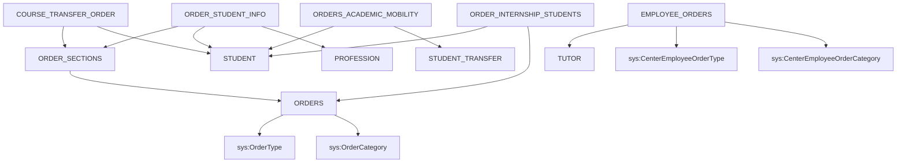

# RF_TFW-1.7 — Приказы

> **Группа:** Приказы по контингенту, параграфы, данные обучающихся в приказах, стажировка
> **Сущностей:** 8 | **Composite Key:** `ORDER_ID_COMPOSITE_KEY`, `SECTION_ID_COMPOSITE_KEY`, `ORDER_STUDENT_INFO_ID_COMPOSITE_KEY`, `UNIVERSITY_ID_COMPOSITE_KEY`

---

## 1. ORDERS — Приказы по движению контингента

**typeCode:** `ORDERS`
**Composite Key:** `ORDER_ID_COMPOSITE_KEY` → `{ type, orderId }`

| Поле | Тип | Обязательное | Описание |
|------|-----|:---:|----------|
| typeCode | string | ✅ | `"ORDERS"` |
| universityId | int32 | ✅ | ID вуза |
| orderId | int32 | ✅ | Уникальный ID приказа |
| orderNumber | string | | Номер приказа |
| orderDate | date | | Дата приказа (`yyyy-MM-dd`) |
| orderTypeId | int32 | | Тип приказа (→ `OrderType`) |
| orderCategoryId | int32 | | Категория приказа (→ `OrderCategory`) |
| nameRu | string | | Название приказа RU |
| year | int32 | | Учебный год |

**FK-зависимости:** `OrderType`, `OrderCategory`

**JSON-пример:**
```json
{
  "typeCode": "ORDERS",
  "universityId": 999,
  "orderId": 801,
  "orderNumber": "П-123",
  "orderDate": "2025-09-01",
  "orderTypeId": 1,
  "orderCategoryId": 1,
  "nameRu": "Приказ о зачислении",
  "year": 2025
}
```

---

## 2. ORDER_SECTIONS — Параграфы приказов

**typeCode:** `ORDER_SECTIONS`
**Composite Key:** `SECTION_ID_COMPOSITE_KEY` → `{ type, sectionId }`

| Поле | Тип | Обязательное | Описание |
|------|-----|:---:|----------|
| typeCode | string | ✅ | `"ORDER_SECTIONS"` |
| universityId | int32 | ✅ | ID вуза |
| sectionId | int32 | ✅ | Уникальный ID параграфа |
| orderId | int32 | | ID приказа (→ Orders) |
| sectionNumber | int32 | | Номер параграфа |
| nameRu | string | | Содержание параграфа RU |
| categoryId | int32 | | Категория |

**FK-зависимости:** `Orders`

---

## 3. ORDER_STUDENT_INFO — Обучающиеся в приказах

**typeCode:** `ORDER_STUDENT_INFO`
**Composite Key:** `ORDER_STUDENT_INFO_ID_COMPOSITE_KEY` → `{ type, orderStudentInfoId }`

| Поле | Тип | Обязательное | Описание |
|------|-----|:---:|----------|
| typeCode | string | ✅ | `"ORDER_STUDENT_INFO"` |
| universityId | int32 | ✅ | ID вуза |
| orderStudentInfoId | int32 | ✅ | Уникальный ID записи |
| sectionId | int32 | | ID параграфа (→ OrderSections) |
| studentId | int32 | | ID обучающегося (→ Student) |
| professionId | int32 | | ГОП (→ Profession) |
| courseNumber | int32 | | Курс |
| studyFormId | int32 | | Форма обучения (→ StudyForms) |

**FK-зависимости:** `OrderSections`, `Student`, `Profession`, `StudyForms`

---

## 4. ORDERS_ADDITIONAL — Дополнительные приказы

**typeCode:** `ORDERS_ADDITIONAL`
**Composite Key:** `UNIVERSITY_ID_COMPOSITE_KEY` → `{ type, id }`

| Поле | Тип | Обязательное | Описание |
|------|-----|:---:|----------|
| typeCode | string | ✅ | `"ORDERS_ADDITIONAL"` |
| universityId | int32 | ✅ | ID вуза |
| id | int32 | ✅ | Уникальный ID приказа |
| orderNumber | string | | Номер приказа |
| orderDate | date | | Дата приказа |
| typeId | int32 | | Тип приказа |
| categoryId | int32 | | Категория приказа |

---

## 5. ORDERS_ACADEMIC_MOBILITY — Приказы по академической мобильности

**typeCode:** `ORDERS_ACADEMIC_MOBILITY`
**Composite Key:** `UNIVERSITY_ID_COMPOSITE_KEY` → `{ type, id }`

| Поле | Тип | Обязательное | Описание |
|------|-----|:---:|----------|
| typeCode | string | ✅ | `"ORDERS_ACADEMIC_MOBILITY"` |
| universityId | int32 | ✅ | ID вашего вуза |
| id | int32 | ✅ | Уникальный ID записи |
| orderId | int32 | ✅ | ID приказа (→ Orders) |
| sectionId | int32 | ✅ | ID параграфа (→ OrderSections) |
| mobilityType | int32 | ✅ | 1=внутренняя, 2=внешняя |
| countryId | int32 | УО | Страна ОВПО-партнера (обяз. при mobilityType=2) |
| **partnerUniversityId** | int32 | ✅ | **ID зарубежного университета (→ ForeignUniversities)** |
| startDate | date | ✅ | Дата начала обучения в ОВПО-партнере |
| finishDate | date | ✅ | Дата окончания обучения |
| studentId | int32 | ✅ | ID обучающегося (→ Student) |
| financingSourceId | int32 | ✅ | ID источника финансирования (→ FinancingSourceAcademicMobility) |
| Start_Study_Year | int32 | ✅ | Год начала обучения |
| Start_Term | int32 | ✅ | Академический период начала |
| Finish_Study_Year | int32 | ✅ | Год окончания обучения |
| Finish_Term | int32 | ✅ | Академический период окончания |
| format | int32 | ✅ | 1=онлайн, 2=офлайн |
| agreementType | int32 | ✅ | 1=по договору, 2=двудипломное, 3=совместная ОП |
| Reject_Order_Id | int32 | | — |
| professionName | string | | Наименование специальности/ГОП |
| professionId | int32 | | ID специальности/ГОП |
| studyLanguageId | int32 | | ID языка обучения |
| transferId | int32 | | ID мобильности (→ StudentTransfer) |

> ⚠️ **NAMING TRAP:** `adm_doc.txt` (Таблица 36) называет поле `universityID`, но фактическое имя JSON-ключа API — **`partnerUniversityId`**. Если отправить `universityID` — API вернёт 200, но поле будет проигнорировано, и название ОВПО-партнёра не отобразится в карточке. Источник: fix 2026-03-18. См. `KNOWLEDGE.md` §1.6.

**FK-зависимости:** `Orders`, `OrderSections`, `Student`, `StudentTransfer`, `ForeignUniversities`, `FinancingSourceAcademicMobility`, `CenterCountry`

---

## 6. COURSE_TRANSFER_ORDER — Приказы о переводе/выпуске

**typeCode:** `COURSE_TRANSFER_ORDER`
**Composite Key:** `UNIVERSITY_ID_COMPOSITE_KEY` → `{ type, id }`

| Поле | Тип | Обязательное | Описание |
|------|-----|:---:|----------|
| typeCode | string | ✅ | `"COURSE_TRANSFER_ORDER"` |
| universityId | int32 | ✅ | ID вуза |
| id | int32 | ✅ | Уникальный ID записи |
| sectionId | int32 | | ID параграфа (→ OrderSections) |
| studentId | int32 | | ID обучающегося (→ Student) |
| gpa | double | | Общий GPA |
| gpaCourse | double | | GPA за курс |
| transferStatus | int32 | | Статус: 4-переведён, 23-не переведён, NULL-выпущен |
| academicDebtDisciplines | string | | Наименования дисциплин-задолженностей |
| diplomaHonor | boolean | | Диплом с отличием |

**FK-зависимости:** `OrderSections`, `Student`

---

## 7. EMPLOYEE_ORDERS — Приказы работников

**typeCode:** `EMPLOYEE_ORDERS`
**Composite Key:** `UNIVERSITY_ID_COMPOSITE_KEY` → `{ type, id }`

| Поле | Тип | Обязательное | Описание |
|------|-----|:---:|----------|
| typeCode | string | ✅ | `"EMPLOYEE_ORDERS"` |
| universityId | int32 | ✅ | ID вуза |
| id | int32 | ✅ | Уникальный ID записи |
| tutorId | int32 | | ID преподавателя (→ Tutor) |
| typeId | int32 | | Тип приказа (→ `CenterEmployeeOrderType`) |
| categoryId | int32 | | Категория (→ `CenterEmployeeOrderCategory`) |
| name | string | | Название |
| number | string | | Номер приказа |
| date | datetime | | Дата приказа |
| fileName | string | | Имя файла |
| dateOfEmployment | datetime | | Дата движения по приказу |

**FK-зависимости:** `Tutor`, `CenterEmployeeOrderType`, `CenterEmployeeOrderCategory`

---

## 8. ORDER_INTERNSHIP_STUDENTS — Приказы по стажировке

**typeCode:** `ORDER_INTERNSHIP_STUDENTS`
**Composite Key:** `UNIVERSITY_ID_COMPOSITE_KEY` → `{ type, id }`

| Поле | Тип | Обязательное | Описание |
|------|-----|:---:|----------|
| typeCode | string | ✅ | `"ORDER_INTERNSHIP_STUDENTS"` |
| universityId | int32 | ✅ | ID вуза |
| id | int32 | ✅ | Уникальный ID |
| studentId | int32 | | ID обучающегося (→ Student) |
| orderId | int32 | | ID приказа (→ Orders) |
| startDate | date | | Дата начала стажировки |
| endDate | date | | Дата окончания |

**FK-зависимости:** `Student`, `Orders`

---

## Граф зависимостей группы



---

## ❓ Поля с неясным описанием

В данной группе **нет** полей с пустым описанием.

---

*Создано: 2026-02-19 | Источник: OpenAPI spec v0 (epvo.kz)*
