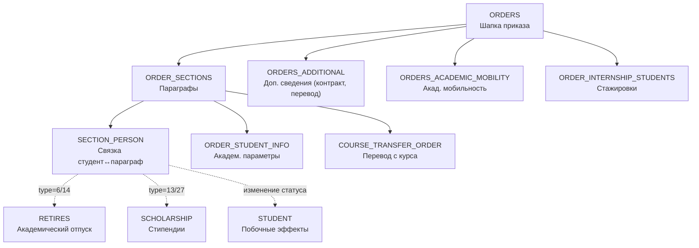

# RF — TFW-5: Функционал приказов по контингенту студентов

> **Дата**: 2026-03-14
> **Автор**: Executor (AI)
> **Статус**: 🟢 RF — Ожидает ревью
> **Parent TS**: [TS__TFW-5__student_orders](TS__TFW-5__student_orders.md)

---

## 1. Иерархия сущностей приказов



**Порядок отправки (общий):**
`ORDERS` → `ORDER_SECTIONS` → `SECTION_PERSON` + `ORDER_STUDENT_INFO` → (вспомогательные сущности) → `STUDENT` update

---

## 2. Полный реестр orderType

### 2.1 Контингентные типы (18 типов — требуют pipeline)

| orderType | Название | Категории (categoryId) | Вспом. сущности |
|:---------:|----------|----------------------|-----------------|
| **2** | Зачисление | 10, 11, 13, 14, 43, 51, 101-112 | `ORDERS_ADDITIONAL` (для перевод/восстановл.) |
| **3** | Отчисление | 1-9, 41-42, 44, 52, 60-61, 201-210, 1008 | `ORDERS_ADDITIONAL` (для перевод в др.ВУЗ) |
| **4** | Перевод | 34-38, 45, 80 | `ORDER_STUDENT_INFO` (old→new поля) |
| **6** | Академический отпуск | 15, 16, 17 | `RETIRES` (обязательно) |
| **7** | Восстановление | 170-175 | `ORDERS_ADDITIONAL` |
| **8** | Изменение перс. данных | 1009 | — |
| **9** | Перевод с курса (доп.дисц.) | 24, ~~25~~ | — |
| **10** | Смена формы оплаты | 46, 47 | `ORDERS_ADDITIONAL` (grantTypeId) |
| **11** | Перевод с курса (по оконч.) | ~~190, 191~~ | — |
| **13** | Назначение стипендии | *(нет категорий)* | `SCHOLARSHIP` |
| **14** | Продление академ. отпуска | *(нет категорий)* | `RETIRES` (обновление) |
| **27** | Прекращение стипендии | *(нет категорий)* | `SCHOLARSHIP` (terminationDate) |
| **28** | Завершение обучения | 160, 161 | `GRADUATES`, `STUDENT_DIPLOMA_INFO` |
| **30** | Выезд акад. мобильность | 301, 302 | `ORDERS_ACADEMIC_MOBILITY` |
| **31** | Возвращение из командировки | 401, 402, 403 | `ORDERS_ACADEMIC_MOBILITY` |
| **32** | Выезд двудипломное | *(нет категорий)* | `ORDERS_ACADEMIC_MOBILITY` |
| **33** | Завершение двудипломного | 801, 802 | — |
| **34** | Перевод с курса (COURSE_TRANSFER) | 601-606 | `COURSE_TRANSFER_ORDER` |

> ~~Зачёркнутые~~ categoryId имеют `is_show=0` — деактивированы, не использовать в основных pipeline.

### 2.2 Не-контингентные и вспомогательные типы (7 типов)

| orderType | Название | Категории | Примечание |
|:---------:|----------|-----------|------------|
| **19** | Повторная сдача ИГА | ~~18~~, 19, ~~62~~, 63, 64, ~~501~~ | Не влияет на контингент |
| **21** | Командирование | 23, 48, ~~49~~, 50, 70 | Перемещение, не статус |
| **22** | Пересдача | 26, 27 | Академическая, не контингент |
| **25** | Дисциплинарные взыскания | 28-31 | Не влияет на статус |
| **26** | Поощрение | 32, 33, 66 | Не влияет на статус |
| **39** | Стажировка | 180, 181 | `ORDER_INTERNSHIP_STUDENTS` |
| **40** | ❓ Неизвестное назначение | 701, 702 | Назначение не задокументировано |

### 2.3 Подготовительное отделение (2 типа)

| orderType | Название | Категории |
|:---------:|----------|-----------|
| **48** | Зачисление (подгот.) | 901, 902, 903 |
| **49** | Отчисление (подгот.) | 1001-1007 |

---

## 3. Pipeline-описания контингентных типов

### 3.1 type=2 — Зачисление

```
1. ORDERS          (orderTypeId=2, categoryId=10/11/13/103/104-106/..., orderDate)
2. ORDER_SECTIONS  (orderId → ORDERS, sectionNumber, categoryId)
3. SECTION_PERSON  (sectionId, personId=studentId, movementDate ⚠️)
4. ORDER_STUDENT_INFO (sectionId, studentId, professionId, courseNumber, studyFormId)
5. ORDERS_ADDITIONAL  (если cat=11/103 — toCenterUniversityId; если cat=13 — восстановление)
6. STUDENT update    (status=1, enrollOrderDate=orderDate)
```

**movementDate:** Обязательна для **всех** категорий, **кроме** приёма (10, 104, 105, 106, 107).
Источник: Инструкция Финансирования, строки 45–65.

### 3.2 type=3 — Отчисление

```
1. ORDERS          (orderTypeId=3, categoryId=1-9/41/42/44/52/60/61/201-210/1008)
2. ORDER_SECTIONS  (orderId, categoryId)
3. SECTION_PERSON  (sectionId, personId, movementDate ✅ обязательна)
4. ORDER_STUDENT_INFO (sectionId, studentId — поля old* для фиксации)
5. ORDERS_ADDITIONAL  (если перевод в др.ВУЗ: toCenterUniversityId ✅ обяз.)
6. STUDENT update    (status=3 или 4, studyStatusId ✅)
```

**Побочные эффекты:** `STUDENT.status → 3` (отчислен) или `4` (выпускник для cat=1).
> ⚠️ Нельзя отправить приказ об отчислении, оставив `status=1`. Источник: `KNOWLEDGE.md` §2.6.

### 3.3 type=4 — Перевод

```
1. ORDERS          (orderTypeId=4, categoryId=34-38/45/80)
2. ORDER_SECTIONS  (orderId, categoryId)
3. SECTION_PERSON  (sectionId, personId, movementDate ✅)
4. ORDER_STUDENT_INFO (sectionId, studentId,
     professionId, studyFormId, courseNumber, studyLanguageId,
     oldProfessionId, oldStudyFormId, oldCourseNumber, oldStudyLanguageId,
     paymentForm, oldPaymentForm)
5. STUDENT update    (professionId, studyFormId, courseNumber → новые значения)
```

> ⚠️ `categoryId=37` (с курса на курс) — `is_show=0`, деактивирована. Для перевода с курса на курс использовать type=34.

### 3.4 type=6 — Академический отпуск

```
1. ORDERS          (orderTypeId=6, categoryId=15/16/17)
2. ORDER_SECTIONS  (orderId, categoryId)
3. SECTION_PERSON  (sectionId, personId, movementDate)
4. RETIRES         (studentId, startDate, finishDate, termscount, startcourse,
                    startyear, startterm, retire_reason ⚠️ см. §5)
5. STUDENT update  (isinretire=1)
```

**Критично:** Запись `RETIRES` уникальна для студента — при продлении (type=14) **обновлять ту же запись**, не создавать новую. Источник: `KNOWLEDGE.md` §2.8.

### 3.5 type=7 — Восстановление

```
1. ORDERS          (orderTypeId=7, categoryId=170-175)
2. ORDER_SECTIONS  (orderId, categoryId)
3. SECTION_PERSON  (sectionId, personId, movementDate ✅)
4. ORDER_STUDENT_INFO (sectionId, studentId, professionId, courseNumber)
5. ORDERS_ADDITIONAL (если из другого ВУЗа)
6. STUDENT update    (status=1)
```

### 3.6 type=10 — Смена формы оплаты

```
1. ORDERS          (orderTypeId=10, categoryId=46 снятие / 47 перевод на грант)
2. ORDER_SECTIONS  (orderId, categoryId)
3. SECTION_PERSON  (sectionId, personId, movementDate ✅)
4. ORDERS_ADDITIONAL (grantTypeId, educationConditionId, savingGrant)
5. STUDENT update    (paymentFormId → новая форма)
```

### 3.7 type=13 — Назначение стипендии

```
1. ORDERS          (orderTypeId=13)
2. ORDER_SECTIONS  (orderId, categoryId)
3. SECTION_PERSON  (sectionId, personId, movementDate, overall_performance ✅)
4. SCHOLARSHIP     (sectionId → SECTION, studentId, scholarshipYear/Month,
                    scholarshipMoney ✅, scholarshipTypeId, overallPerformance,
                    scholarshipAwardYear, scholarshipAwardTerm)
```

Подробный маппинг `SCHOLARSHIP` → `RF_TFW-4.D` §3.3 и `KNOWLEDGE.md` §2.9.

**Справочник `scholarshipTypeId`:**
- **Эндпоинт:** `GET /common-dictionary/SCHOLARSHIP_TYPE/find-all`
- **Полная выгрузка:** [scholarship_types_full.json](scholarship_types_full.json) — 77 записей, каждый тип × `degreeId`.
- **Ключевое:** Один тип стипендии (напр. «Минимальная государственная») имеет **разные `id`** для каждой акад. степени. При выборе `scholarshipTypeId` нужно учитывать `degreeId` студента.

### 3.8 type=14 — Продление академического отпуска

```
1. ORDERS          (orderTypeId=14)
2. ORDER_SECTIONS  (orderId)
3. SECTION_PERSON  (sectionId, personId)
4. RETIRES update  (та же запись! termscount++, finishDate сдвиг,
                    ВСЕ поля повторно ⚠️ Full Replace)
```

> ⚠️ Дубликаты `RETIRES` = ошибка. Источник: `KNOWLEDGE.md` §2.8.

### 3.9 type=27 — Прекращение стипендии

```
1. ORDERS          (orderTypeId=27)
2. ORDER_SECTIONS  (orderId)
3. SECTION_PERSON  (sectionId, personId)
4. SCHOLARSHIP update (terminationDate, termination_ord_sectionid=sectionId,
                       scholarshipMoney=0)
```

### 3.10 type=28 — Завершение обучения (Выпуск)

```
1. TRANSCRIPT      (все оценки за финальную сессию — до приказа!)
2. ORDERS          (orderTypeId=28, categoryId=160 магистратура / 161 докторантура)
   — ИЛИ orderTypeId=3 categoryId=1 (отчисление по выпуску для бакалавриата)
3. ORDER_SECTIONS  (orderId)
4. SECTION_PERSON  (sectionId, personId, movementDate ✅)
5. STUDENT update  (status=4, courseNumber=0)
6. STUDENT_DIPLOMA_INFO (diplomaSeries, diplomaNumber, diplomaDate)
7. GRADUATES       (полный профиль — ~20 not null полей)
```

Sequencing Contract обязателен. Подробности → `RF_TFW-4.E` §2.

### 3.11 type=30/32 — Выезд акад. мобильность / двудипломное

```
1. ORDERS          (orderTypeId=30/32, categoryId=301/302 или нет)
2. ORDER_SECTIONS  (orderId)
3. SECTION_PERSON  (sectionId, personId)
4. ORDERS_ACADEMIC_MOBILITY (orderId, studentId, transferId)
5. STUDENT update  (academicMobility → обновить флаг)
```

### 3.12 type=31/33 — Возвращение / завершение

```
1. ORDERS          (orderTypeId=31/33, categoryId=401/402/403 или 801/802)
2. ORDER_SECTIONS  (orderId)
3. SECTION_PERSON  (sectionId, personId)
4. STUDENT update  (academicMobility → сбросить)
```

### 3.13 type=34 — Перевод с курса на курс (COURSE_TRANSFER)

```
1. ORDERS          (orderTypeId=34, categoryId=601-606)
2. ORDER_SECTIONS  (orderId, categoryId)
3. SECTION_PERSON  (sectionId, personId)
4. COURSE_TRANSFER_ORDER (sectionId, studentId, gpa, gpaCourse,
                          transferStatus: 4=переведён, 23=не переведён, null=выпущен)
5. STUDENT update  (courseNumber → новый курс)
```

### 3.14 type=39 — Стажировка

```
1. ORDERS          (orderTypeId=39, categoryId=180/181)
2. ORDER_SECTIONS  (orderId)
3. ORDER_INTERNSHIP_STUDENTS (orderId, studentId, startDate, endDate)
```

### 3.15 type=48/49 — Подготовительное отделение

```
type=48 (зачисление):
1. ORDERS → ORDER_SECTIONS → SECTION_PERSON
   movementDate: обязательна для cat=903 (другие причины)
   STUDENT update: status=1

type=49 (отчисление):
1. ORDERS → ORDER_SECTIONS → SECTION_PERSON (movementDate ✅ всегда)
   STUDENT update: status=3
```

---

## 4. Побочные эффекты на STUDENT

| orderType | status | isinretire | courseNumber | Другие поля |
|:---------:|:------:|:----------:|:-----------:|-------------|
| 2 (зачисление) | → 1 | — | устанавливается | `enrollOrderDate`, `enrollYear` |
| 3 (отчисление) | → 3 | → 0 | — | `studyStatusId` ✅ |
| 3 cat=1 (выпуск) | → 4 | — | → 0 | — |
| 4 (перевод) | — | — | может измениться | `professionId`, `studyFormId`, `studyLanguageId` |
| 6 (академ.отпуск) | — | → 1 | — | — |
| 6 (выход) | — | → 0 | — | `RETIRES.finished=true` |
| 7 (восстановление) | → 1 | — | устанавливается | — |
| 8 (изм.перс.данных) | — | — | — | ФИО, ИИН и т.д. |
| 10 (смена оплаты) | — | — | — | `paymentFormId` |
| 14 (продление) | — | 1 (остаётся) | — | `RETIRES` update |
| 28 (завершение) | → 4 | — | → 0 | + `GRADUATES` + `STUDENT_DIPLOMA_INFO` |
| 30/32 (выезд моб.) | — | — | — | `academicMobility` флаг |
| 31/33 (возврат) | — | — | — | `academicMobility` сброс |
| 34 (перевод курса) | — | — | → новый | `COURSE_TRANSFER_ORDER` |
| 48 (подгот. зачисл.) | → 1 | — | — | — |
| 49 (подгот. отчисл.) | → 3 | — | — | — |

---

## 5. Маппинг retire_reason (для type=6, 14)

| # | Причина в финансировании | orderType | categoryId | retire_reason |
|---|--------------------------|:---------:|:----------:|:-------------:|
| 1 | Беременность и роды | 6 | 17 | `1` |
| 2 | Усыновление/удочерение | 6 | 17 | `2` |
| 3 | Туберкулёз | 6 | 16 | `1` |
| 4 | Другие мед. показания | 6 | 16 | `2` |
| 5 | Призыв на воинскую службу | 6 | 15 | — |
| 6 | По состоянию здоровья | 6 | 16 | *(пустое)* |
| 7 | Рождение/усыновление ребенка | 6 | 17 | *(пустое)* |
| 8 | Продление академ. отпуска | 14 | — | *(пустое)* |
| 9 | Уход за ребенком до 3 лет | 6 | 17 | `3` |

> ⚠️ Если `retire_reason` не заполнен — причина **не отображается** в карточке финансирования. Источник: чат ЕПВО, Бахтияр 10.11.2025.

Дополнительные обязательные поля `RETIRES` при определённых причинах:
- **Причины 1, 3** (беременность, туберкулёз) → `inability_start_date`, `inability_end_date` обязательны.
- **Причина 9** (уход за ребенком) → `inability_start_date`, `inability_end_date` — рекомендованы.

---

## 6. Правила movement_date

| orderType | Категории | movement_date |
|:---------:|-----------|:-------------:|
| 2 (зачисление) | 10, 104-108 (приём) | Не обязательна |
| 2 (зачисление) | все остальные (перевод, восстановл.) | ✅ Обязательна |
| 3 (отчисление) | все | ✅ Обязательна |
| 4 (перевод) | все | ✅ Обязательна |
| 6 (выход из отпуска) | — | ✅ Обязательна |
| 7 (восстановление) | все | ✅ Обязательна |
| 10 (смена оплаты) | все | ✅ Обязательна |
| 31 (возврат моб.) | 401, 402 | ✅ Обязательна |
| 48 (подгот. зачисл.) | 903 (другие причины) | ✅ Обязательна |
| 49 (подгот. отчисл.) | все | ✅ Обязательна |

> `movement_date` — дата вступления приказа в силу. Определяет месяц прекращения финансирования. Источник: `KNOWLEDGE.md` §2.6, Инструкция Финансирования.

---

## 7. Правила ORDERS_ADDITIONAL

| orderType | categoryId | Обязательные поля ordersadditional |
|:---------:|:----------:|--------------------------------------|
| 3 | 4 (перевод в отечеств.) | `toCenterUniversityId` ✅ |
| 3 | 204 (перевод в зарубежн.) | `toCenterUniversityId` ✅, `universityKz/Ru/En` |
| 2 | 11 (перевод из зарубежн.) | `oldCenterUniversityId` |
| 2 | 103 (перевод из отечеств.) | `oldCenterUniversityId` |
| 10 | 46 (снятие с гранта) | `grantTypeId`, `educationConditionId` |
| 10 | 47 (перевод на грант) | `grantTypeId`, `educationConditionId`, `savingGrant` |
| 2/7 | восстановление/возврат | `contractNumber`, `contractSum`, `contractDate` (при договоре) |

---

## 8. Дублирование типов «перевод с курса»

| orderType | Назв. | Категории | Использование | Статус |
|:---------:|-------|-----------|---------------|--------|
| **4** cat=37 | Перевод: с курса на курс | 37 | ~~Деактивирован~~ `is_show=0` | ❌ |
| **9** | Перевод с курса (доп.дисц.) | 24, ~~25~~ | Разрешение доп.дисциплин | ⚠️ cat=25 `is_show=0` |
| **11** | Перевод с курса (по оконч.) | ~~190, 191~~ | Оба `is_show=0` | ❌ |
| **34** | COURSE_TRANSFER_ORDER | 601-606 | **Основной актуальный** | ✅ |

> **Вывод:** Для перевода с курса на курс использовать **type=34** с `COURSE_TRANSFER_ORDER`. Типы 4/37, 11 — деактивированы. Тип 9 — только для специального случая (доп.дисциплины, cat=24).

---

## 9. Пробелы и неопределённости

| # | Описание | Статус |
|---|----------|--------|
| 1 | **orderType=40** (categoryId 701/702) — назначение не задокументировано ни в инструкциях, ни в чате | ❓ Неизвестно |
| 2 | **`SECTION_PERSON` vs `sectionpersons`** — в RF_TFW-1.7 описана как «Спортивные секции», а в `adm_doc.txt` Таблица 58 — как связка студент↔параграф приказа. Naming collision | ⚠️ Верно: `sectionpersons` = SECTION_PERSON |
| 3 | **orderType=8 cat=1009** — «Изменение персональных данных». Pipeline минимален (ORDERS→SECTIONS→PERSON), но неясно, какие поля STUDENT обновляются автоматически | ❓ Требует проверки |
| 4 | **Категории type=13 и type=27** — в справочнике `ORDER_CATEGORY` нет явных записей для стипендий. Pipeline работает, но `categoryId` в `ORDER_SECTIONS` может быть `null` | ⚠️ Допустимо |
| 5 | **orderType=19** — повторная ИГА; 4 из 6 категорий имеют `is_show=0`; неясно, какие категории актуальны | ⚠️ Использовать cat=19, 63, 64 |

---

## 10. Observations (out-of-scope, not modified)

| # | File | Type | Description |
|---|------|------|-------------|
| 1 | `RF_TFW-4.C` | naming | `Order.orderType` в RF_TFW-4.C записано как int поле `orderType`, а в RF_TFW-1.7 — `orderTypeId`. Интегратор должен верифицировать имя JSON-ключа |
| 2 | `RF_TFW-1.7` | naming | `SECTION_PERSON` не задокументирована в RF_TFW-1.7 как отдельная сущность (упомянута только как ORDER_STUDENT_INFO). Фактически sectionpersons — отдельная сущность (Таблица 58 adm_doc) |
| 3 | `KNOWLEDGE.md` | duplication | Раздел «3. Решение частых проблем» дублирован (строки 289-295 и 363-369 — идентичный текст) |
| 4 | `RF_TFW-4.E` | inconsistency | В §6.1 указан `orderType=6` для приказа о выпуске, но в §2 — orderType=28 cat=160/161. Фактически `6` — это академический отпуск, для выпуска бакалавров — type=3 cat=1, для магистратуры/докторантуры — type=28 |
| 5 | Общее | improvement | Отсутствует единый справочник `OrderType` в виде отдельного RF/KNOWLEDGE раздела — значения orderType рассредоточены по 5+ документам |

---

*RF — TFW-5: Функционал приказов по контингенту студентов | 2026-03-14*
