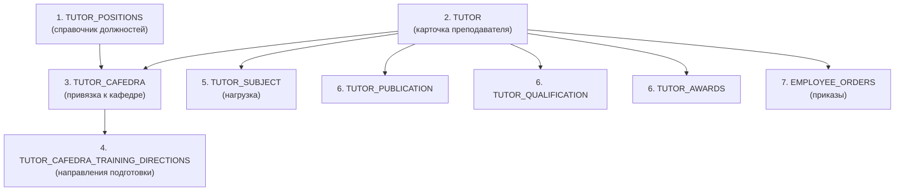
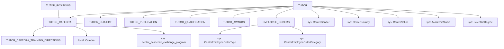

# RF_TFW-8 — Маппинг данных ППС (преподавателей) для ЕПВО

> **Группа:** Преподаватели (ППС), связи с кафедрами, квалификация, публикации, награды, приказы
> **Источники:** OpenAPI spec v0, чат ЕПВО (2023-H2, 2025-H1), Инструкция Адм. отчёты (01.10.2025)
> **Сущностей:** 9 + справочники

---

## Содержание

1. [TUTOR — Основная карточка преподавателя](#1-tutor)
2. [TUTOR_CAFEDRA — Связь преподаватель-кафедра](#2-tutor_cafedra)
3. [TUTOR_CAFEDRA_TRAINING_DIRECTIONS — Направления подготовки](#3-tutor_cafedra_training_directions)
4. [TUTOR_POSITIONS — Должности ППС](#4-tutor_positions)
5. [TUTOR_SUBJECT — Нагрузка (дисциплины)](#5-tutor_subject)
6. [TUTOR_PUBLICATION — Публикации](#6-tutor_publication)
7. [TUTOR_QUALIFICATION — Повышение квалификации](#7-tutor_qualification)
8. [TUTOR_AWARDS — Награды](#8-tutor_awards)
9. [EMPLOYEE_ORDERS — Приказы по сотрудникам](#9-employee_orders)
10. [Sequencing Contract — Порядок отправки](#10-sequencing-contract)
11. [Бизнес-логика фильтрации ППС для отчётов](#11-бизнес-логика)
12. [Gotchas и Known Issues](#12-gotchas)

---

## 1. TUTOR

**typeCode:** `TUTOR`
**Composite Key:** `TUTOR_ID_COMPOSITE_KEY` → `{ type, tutorId }`
**Источник:** OpenAPI spec + PDF Адм. отчёты Table 5 (стр. 27–31)

### 1.1 Основные поля

| Поле | Тип | Обяз. | Описание | Условия / Значения |
|------|-----|:-----:|----------|-------------------|
| typeCode | string | ✅ | `"TUTOR"` | |
| universityId | int32 | ✅ | ID вуза | |
| tutorId | int32 | ✅ | Уникальный ID преподавателя | |
| firstName | string | ✅ | Имя | |
| lastName | string | ✅ | Фамилия | |
| patronymic | string | | Отчество | |
| birthDate | date | ✅ | Дата рождения | `yyyy-MM-dd` |
| genderId | int32 | ✅ | Пол (→ `CenterGender`) | |
| iinplt | string(32) | ✅ | ИИН преподавателя | |
| citizenshipid | int32 | ✅ | ID гражданства (→ `CenterCountry`) | **STRICT: ≠ null** (400/500 при null) |
| nationId | int32 | | Национальность (→ `CenterNation`) | |
| academicStatusId | int32 | | Академическое звание (→ `AcademicStatus`) | |
| scientificDegreeId | int32 | | Учёная степень (→ `ScientificDegree`) | |
| ismarried | int32 | ✅ | Семейное положение | → справочник «Семейное положение» |
| mail | string(512) | | Электронная почта | |
| mobilephone | string(16) | | Номер мобильного телефона | |
| length_workall | int32 | ✅ | Общий стаж работы | |
| work_status | int32 | | Статус сотрудника | 2 = совместитель (для не-ППС) |
| departmentid | int32 | | ID отделения из structural_subdivision | |

### 1.2 Документ, удостоверяющий личность

| Поле | Тип | Обяз. | Описание | Условия |
|------|-----|:-----:|----------|---------|
| ictype | int32 | | Тип документа | |
| icnumber | string(256) | ✅ | Номер документа | |
| icdate | date | ✅ | Дата выдачи | |
| icdepartment | string(256) | ✅ | Орган выдачи (текстовое) | |
| icdepartmentid | int32 | | Орган выдачи (ID) | |
| icseries | string(256) | | Серия документа | |

### 1.3 Признаки статуса

| Поле | Тип | Обяз. | Описание | Влияние |
|------|-----|:-----:|----------|---------|
| maternity_leave | bool | ✅ | В декретном отпуске | Фильтр СУР/Адм. отчётов |
| on_foreign_trip | bool | | В зарубежной командировке | Фильтр Адм. отчётов (ВП-34) |
| ftutor | bool | УО | Иностранный преподаватель | См. § 1.4 |

### 1.4 Поля иностранного преподавателя (f-блок)

> **Условие заполнения:** `ftutor=true` обязательно, если `tutor_cafedra.type=2 AND tutor_cafedra.primaryEmploymentID=2` (внешний совместитель из зарубежного ВУЗа). PDF instruction (2025-10) указывает `primaryEmploymentID=1`, но чат и инструкция 2023 подтверждают `2=ВУЗ зарубежный`. ⚠️ **Требует верификации**.

| Поле | Тип | Обяз. | Описание | Условия |
|------|-----|:-----:|----------|---------|
| ftutor | bool | УО | Иностранный преподаватель | true если type=2 && primaryEmploymentID=2 |
| fcountryId | int32 | УО | Страна прибытия (→ `CenterCountry`) | Обяз. если ftutor=true |
| funiversityid | int32 | УО | ОВПО прибытия | |
| fuplaceworldrankings | int32 | | Место в мировых рейтингах | |
| fnumberhoursrk | int32 | | Кол-во часов РК | |
| fnumberhoursects | int32 | | Кол-во часов ECTS | |
| fsourceoffinance | int32 | | Источник финансирования | |
| fofallcosts | double | | Всего расходы, тыс. тг | |
| scientificfieldid | int32 | | Научная область | |

### 1.5 Регистрация проживания (для иностранных граждан)

| Поле | Тип | Обяз. | Описание | Условия |
|------|-----|:-----:|----------|---------|
| liveRegType | int32 | УО | Тип регистрации проживания | Обяз. если иностранное гражданство |
| livingPeriodStart | date | УО | Дата начала пребывания | Обяз. если liveRegType=2 |
| livingPeriodEnd | date | УО | Дата окончания пребывания | |
| allowanceNumber | string | УО | Номер РВП | Обяз. если liveRegType=1 |
| allowanceDateStart | date | УО | Дата начала РВП | |
| allowanceDateEnd | date | УО | Дата окончания РВП | |

> **liveRegType:** 1=Разрешение на временное проживание (РВП), 2=Уведомление о прибытии

### 1.6 Научные идентификаторы

| Поле | Тип | Обяз. | Описание | Валидация |
|------|-----|:-----:|----------|-----------|
| scopusid | string | | ID в Scopus (Elsevier) | Только цифры, 9–13 символов |
| webofscienceid | string | | ID в Web of Science | Только цифры и лат. буквы |

### 1.7 Место проживания/прописки

| Поле | Тип | Обяз. | Описание |
|------|-----|:-----:|----------|
| registration_place_cato_id | int32 | | Населённый пункт прописки (КАТО) |
| living_place_cato_id | int32 | | Населённый пункт проживания (КАТО) |
| main_place_of_work | int32 | | Основное место работы (1/2/3) |

> Значения `main_place_of_work`: 1=ВУЗ отечественный, 2=ВУЗ зарубежный, 3=Организация

### 1.8 Бизнес-правила TUTOR

1. **`citizenshipid ≠ null`** — обязательное поле. При null → 400/500. Аналогично STUDENT.
2. **`maternity_leave`** — используется как фильтр в Адм. отчётах и СУР. `false` = активен.
3. **`ftutor`** — не единственный критерий «иностранности». ЕПВО дополнительно проверяет `citizenshipid ≠ 113` у штатных. Если ППС не иностранный: `ftutor=false/0` + все `f*`-поля не заполнять.
4. **`on_foreign_trip`** — для отчёта ВП-34 (академ. обмен каз. ППС).

### 1.9 JSON-пример (TUTOR, полный)

```json
{
  "typeCode": "TUTOR",
  "universityId": 999,
  "tutorId": 3200,
  "firstName": "Иван",
  "lastName": "Петров",
  "patronymic": "Сергеевич",
  "birthDate": "1985-03-15",
  "genderId": 1,
  "iinplt": "850315350124",
  "citizenshipid": 113,
  "nationId": 1,
  "academicStatusId": 2,
  "scientificDegreeId": 3,
  "ismarried": 1,
  "mail": "petrov@university.kz",
  "mobilephone": "+77001234567",
  "length_workall": 15,
  "maternity_leave": false,
  "on_foreign_trip": false,
  "ftutor": false,
  "ictype": 1,
  "icnumber": "012345678",
  "icdate": "2020-01-15",
  "icdepartment": "МВД РК",
  "scopusid": "123456789",
  "webofscienceid": "ABC1234567"
}
```

---

## 2. TUTOR_CAFEDRA

**typeCode:** `TUTOR_CAFEDRA`
**Composite Key:** `UNIVERSITY_ID_COMPOSITE_KEY` → `{ type, id }`
**Источник:** OpenAPI spec + PDF Адм. отчёты Table 6 (стр. 31–33)

### 2.1 Основные поля

| Поле | Тип | Обяз. | Описание | Условия / Значения |
|------|-----|:-----:|----------|-------------------|
| typeCode | string | ✅ | `"TUTOR_CAFEDRA"` | |
| universityId | int32 | ✅ | ID вуза | |
| id | int32 | ✅ | Уникальный ID записи | |
| tutorId | int32 | ✅ | ID преподавателя (→ TUTOR) | |
| cafedraId | int32 | ✅ | ID кафедры (→ справочник ОВПО) | |
| position | int32 | | ID должности (→ `TUTOR_POSITIONS`) | |
| rate | double | | Ставка | |
| type | int32 | ✅ | Тип занятости | **0=Штатный, 1=Внутр. совместитель, 2=Внешний совместитель** |
| deleted | bool | ✅ | Признак «Уволен» | |
| hourlyfund | bool | | Почасовой фонд | |

### 2.2 Поля внешнего совместителя (обяз. при type=2)

| Поле | Тип | Обяз. | Описание | Условия |
|------|-----|:-----:|----------|---------|
| primaryEmploymentID | int32 | УО | Основное место работы | Обяз. при type=2 |
| et_contract_start_date | date | УО | Дата начала договора | Обяз. при type=2 |
| et_contract_finish_date | date | УО | Дата окончания договора | Обяз. при type=2 |
| et_by_agreement | bool | ✅ | Признак «По договору» | Обяз. при type=2 && primaryEmploymentID=2 |

> **`primaryEmploymentID`:** 1=ВУЗ отечественный, 2=ВУЗ зарубежный, 3=Организация
> Подтверждено: чат 2023-H2 (Бахтияр, 30.04.2025).

### 2.3 Поля академического обмена (новые, из PDF 01.10.2025)

| Поле | Тип | Обяз. | Описание |
|------|-----|:-----:|----------|
| academic_exchange_program | int32 | | Программа академ. обмена (→ `center_academic_exchange_program`) |
| lectures_made_hours | int32 | | Кол-во лекций (часы) |
| seminars_made_hours | int32 | | Кол-во семинаров (часы) |
| master_class_made_hours | int32 | | Кол-во мастер-классов (часы) |
| trainings_made_hours | int32 | | Кол-во тренингов (часы) |
| was_speaker_on_conferences | int32 | | Спикер на конференциях |
| foreignconsultant | bool | | Зарубежный консультант |
| developed_working_programs | int32 | | Разработка рабочих программ |
| additional_work | string | | Доп. работы в ОВПО |
| format_of_work | int32 | | Формат работы |
| fsourceOfFinance | int32 | | Источник финансирования |
| publication_activity | int32 | | Публикационная активность |

### 2.4 Бизнес-правила TUTOR_CAFEDRA

1. **Один tutor → несколько записей** — разные кафедры/должности.
2. **Увольнение:** `deleted = true`. Запись **не удаляется**, а помечается.
3. **Внешний совместитель из зарубежного ВУЗа:** `type=2, primaryEmploymentID=2, et_by_agreement=true`.
4. **Кардинальность:** `tutorId` → FK на `TUTOR.tutorId`, `cafedraId` → FK на справочник кафедр ОВПО, `position` → FK на `TUTOR_POSITIONS`.

### 2.5 JSON-пример (TUTOR_CAFEDRA, внешний совместитель)

```json
{
  "typeCode": "TUTOR_CAFEDRA",
  "universityId": 999,
  "id": 1255,
  "tutorId": 3200,
  "cafedraId": 42,
  "position": 5,
  "rate": 0.5,
  "type": 2,
  "deleted": false,
  "primaryEmploymentId": 2,
  "etContractStartDate": "2023-01-24T18:00:00.000+00:00",
  "etContractFinishDate": "2025-01-24T18:00:00.000+00:00",
  "etByAgreement": true,
  "hourlyfund": false
}
```

> Источник JSON-формата: чат ЕПВО, 2023-H2 (реальный запрос ОВПО).

---

## 3. TUTOR_CAFEDRA_TRAINING_DIRECTIONS

**typeCode:** `TUTOR_CAFEDRA_TRAINING_DIRECTIONS`
**Composite Key:** `UNIVERSITY_ID_COMPOSITE_KEY` → `{ type, id }`

| Поле | Тип | Обяз. | Описание |
|------|-----|:-----:|----------|
| typeCode | string | ✅ | `"TUTOR_CAFEDRA_TRAINING_DIRECTIONS"` |
| universityId | int32 | ✅ | ID вуза |
| id | int32 | ✅ | Уникальный ID записи |
| tutorCafedraId | int32 | ✅ | ID записи tutor_cafedra (→ `TUTOR_CAFEDRA`) |
| trainingDirectionId | int32 | ✅ | ID направления подготовки |

**Кардинальность:** Одна `tutor_cafedra` запись → несколько `training_directions` записей (One-to-Many).

**Бизнес-правила:**
- Каждая запись привязывает преподавателя (через его кафедру) к направлению подготовки.
- Используется для отображения ППС в отчётах СУР.

**JSON-пример:**
```json
{
  "typeCode": "TUTOR_CAFEDRA_TRAINING_DIRECTIONS",
  "universityId": 42,
  "id": 858,
  "tutorCafedraId": 1255,
  "trainingDirectionId": 74
}
```

---

## 4. TUTOR_POSITIONS

**typeCode:** `TUTOR_POSITIONS`
**Composite Key:** `UNIVERSITY_ID_COMPOSITE_KEY` → `{ type, id }`

| Поле | Тип | Обяз. | Описание |
|------|-----|:-----:|----------|
| typeCode | string | ✅ | `"TUTOR_POSITIONS"` |
| universityId | int32 | ✅ | ID вуза |
| id | int32 | ✅ | Уникальный ID должности |
| nameRu | string | | Название должности (RU) |
| nameKz | string | | Название должности (KZ) |
| nameEn | string | | Название должности (EN) |
| isPps | bool | | Является ли должность ППС |

---

## 5. TUTOR_SUBJECT

**typeCode:** `TUTOR_SUBJECT`
**Composite Key:** `TUTOR_SUBJECT_ID_COMPOSITE_KEY` → `{ type, tutorSubjectId }`

| Поле | Тип | Обяз. | Описание |
|------|-----|:-----:|----------|
| typeCode | string | ✅ | `"TUTOR_SUBJECT"` |
| universityId | int32 | ✅ | ID вуза |
| tutorSubjectId | int32 | ✅ | Уникальный ID записи |
| tutorId | int32 | | ID преподавателя (→ TUTOR) |
| subjectId | int32 | | ID дисциплины |
| year | int32 | | Учебный год |
| term | int32 | | Семестр |
| hours | int32 | | Количество часов |

---

## 6. TUTOR_PUBLICATION

**typeCode:** `TUTOR_PUBLICATION`
**Composite Key:** (уточняется — `PUB_ID_COMPOSITE_KEY` или `UNIVERSITY_ID_COMPOSITE_KEY`)

| Поле | Тип | Обяз. | Описание |
|------|-----|:-----:|----------|
| typeCode | string | ✅ | `"TUTOR_PUBLICATION"` |
| universityId | int32 | ✅ | ID вуза |
| pubId / id | int32 | ✅ | Уникальный ID публикации |
| tutorId | int32 | | ID преподавателя (→ TUTOR) |
| title | string | | Название публикации |
| publicationLevelId | int32 | | Уровень публикации |
| publicationDate | date | | Дата публикации |
| doi | string | | DOI |
| resourceId | int32 | | ID ресурса |

---

## 7. TUTOR_QUALIFICATION

**typeCode:** `TUTOR_QUALIFICATION`
**Composite Key:** (→ `qualId`)
**Источник:** PDF Адм. отчёты Table 7 (стр. 33–34)

| Поле | Тип | Обяз. | Описание |
|------|-----|:-----:|----------|
| typeCode | string | ✅ | `"TUTOR_QUALIFICATION"` |
| universityId | int32 | ✅ | ID вуза |
| qualId | int32 | ✅ | Уникальный ID записи |
| tutorId | int32 | ✅ | ID преподавателя |
| paymentformid | int32 | ✅ | Источник финансирования |
| place | string(256) | ✅ | Наименование организации |
| form | string(512) | ✅ | Форма повышения квалификации |
| length | string(512) | ✅ | Продолжительность и объём (час) |
| start | date | ✅ | Начало |
| finish | date | ✅ | Окончание |
| resourceId | int32 | ✅ | ID ресурса |
| doctype | int32 | ✅ | Вид подтверждающего документа |
| country | string(256) | ✅ | Страна |
| city | string(256) | ✅ | Город |
| tematika | string(256) | ✅ | Тематика |
| professiontype | int32 | ✅ | Группа специальности |
| placeoffuthereducation | int32 | ✅ | Место прохождения ПК (на базе) |
| paymentsum | int32 | ✅ | Сумма (тыс. тенге) |
| citizenshipid | int32 | ✅ | Гражданство |

---

## 8. TUTOR_AWARDS

**typeCode:** `TUTOR_AWARDS`
**Composite Key:** `UNIVERSITY_ID_COMPOSITE_KEY` → `{ type, id }`

| Поле | Тип | Обяз. | Описание |
|------|-----|:-----:|----------|
| typeCode | string | ✅ | `"TUTOR_AWARDS"` |
| universityId | int32 | ✅ | ID вуза |
| id | int32 | ✅ | Уникальный ID записи |
| tutorId | int32 | | ID преподавателя |
| awardTypeId | int32 | | Тип награды (→ `CenterAwardType`) |
| awardDate | date | | Дата награждения |
| description | string | | Описание |

---

## 9. EMPLOYEE_ORDERS

**typeCode:** `EMPLOYEE_ORDERS`
**Composite Key:** `UNIVERSITY_ID_COMPOSITE_KEY` → `{ type, id }`
**Источник:** RF_TFW-1.7 + чат ЕПВО

| Поле | Тип | Обяз. | Описание |
|------|-----|:-----:|----------|
| typeCode | string | ✅ | `"EMPLOYEE_ORDERS"` |
| universityId | int32 | ✅ | ID вуза |
| id | int32 | ✅ | Уникальный ID записи |
| tutorId | int32 | | ID преподавателя (→ TUTOR) |
| typeId | int32 | | Тип приказа (→ `CenterEmployeeOrderType`) |
| categoryId | int32 | | Категория (→ `CenterEmployeeOrderCategory`) |
| name | string | | Название |
| number | string | | Номер приказа |
| date | datetime | | Дата приказа |
| fileName | string | | Имя файла |
| dateOfEmployment | datetime | | Дата движения по приказу |

**Бизнес-правила:**
- Типы приказов (`CenterEmployeeOrderType`): только **приём** и **увольнение**. Декретные не оформляются приказом — используется `tutors.maternity_leave`.
- `date` используется в СУР для определения периода работы уволенных штатных ППС.
- `dateOfEmployment` — фактическая дата движения (может отличаться от `date`).

---

## 10. Sequencing Contract



| Шаг | Сущность | Зависит от |
|-----|----------|------------|
| 1 | `TUTOR_POSITIONS` | — (справочник ОВПО) |
| 2 | `TUTOR` | — (базовая карточка) |
| 3 | `TUTOR_CAFEDRA` | TUTOR, CAFEDRA (справочник), TUTOR_POSITIONS |
| 4 | `TUTOR_CAFEDRA_TRAINING_DIRECTIONS` | TUTOR_CAFEDRA |
| 5 | `TUTOR_SUBJECT` | TUTOR |
| 6 | `TUTOR_PUBLICATION`, `TUTOR_QUALIFICATION`, `TUTOR_AWARDS` | TUTOR (параллельно) |
| 7 | `EMPLOYEE_ORDERS` | TUTOR |

---

## 11. Бизнес-логика фильтрации ППС для отчётов

### 11.1 Базовый фильтр активных ППС

```sql
tc.deleted = false
AND tc.type IS NOT NULL
AND (t.maternity_leave = false OR t.maternity_leave IS NULL)
```

> Источник: чат ЕПВО, 2023-H2.

### 11.2 Фильтр СУР — «Иностранные преподаватели» (4-блочная OR-конструкция)

> Источник: Айдар Буранбаев, 30.04.2025. Чат ЕПВО 2025-H1.

```
BLOCK 1 — Внешний совместитель из зарубежного ВУЗа:
  tutor_cafedra.type = 2
  AND tutor_cafedra.primaryEmploymentID = 2
  AND tutor_cafedra.deleted IS NOT TRUE
  AND tutor.maternity_leave IS NOT TRUE

BLOCK 2 — Штатный с иностранным гражданством:
  tutor_cafedra.type = 0
  AND tutor.citizenshipid <> 113
  AND tutor_cafedra.deleted IS NOT TRUE
  AND tutor.maternity_leave IS NOT TRUE

BLOCK 3 — Уволенный, период работы пересекается с периодом СУР:
  tutor_cafedra.deleted = TRUE
  AND (период договора ∪ период приказов) ∩ период_СУР ≠ ∅

BLOCK 4 — Преподаватель с признаком «Иностранный»:
  tutor_cafedra.deleted IS NOT TRUE
  AND tutor.maternity_leave IS NOT TRUE
  AND tutor.ftutor = TRUE
```

### 11.3 ВП-4 — Повышение квалификации ППС

```
tutor_cafedra.type IN (0, 1, 2)
AND tutors.deleted = 0
AND tutors.maternity_leave = 0
AND tutors.on_foreign_trip = 0
AND tutorqual.start/finish пересекается с текущим периодом
```

### 11.4 ВП-34 — Академический обмен казахстанского ППС

```
tutors.citizenshipid != 113
AND tutor_cafedra.type IN (0, 1)
AND tutors.on_foreign_trip = 1
AND tutors.deleted = 0
AND tutors.maternity_leave = 0
```

### 11.5 ВП-35 — Зарубежные учёные в ОВПО

**Для ППС:**
```
tutors.citizenshipid != 113
AND tutor_cafedra.type = 2
AND (tutor_cafedra.hourlyFund = 1 OR tutor_cafedra.et_by_agreement = 1)
AND tutor_cafedra.primaryEmploymentID = 2
AND tutors.deleted = 0
AND tutors.maternity_leave = 0
```

**Для сотрудников (не ППС):**
```
tutors.citizenshipid != 113
AND tutors.work_status = 2
AND tutors.deleted = 0
AND tutors.maternity_leave = 0
```

---

## 12. Gotchas и Known Issues

| # | Проблема | Источник | Mitigation |
|---|----------|----------|------------|
| 1 | **`TUTOR_CAFEDRA` delete временно отключён** | Babur Rustauletov, чат 13.11.2025: «TUTOR_CAFEDRA убрали удаление?» | Использовать `deleted=true` вместо физического удаления |
| 2 | **`TUTOR_CAFEDRA_TRAINING_DIRECTIONS` — 500 ошибка** | Чат 2023-H2: при отправке второй записи для того же `tutorCafedraId` с другим `trainingDirectionId` → 500 | Убедиться что `id` уникален. Может быть баг на стороне ЕПВО |
| 3 | **`primaryEmploymentID=0` не работает** | Чат 2023-H2: ставили 0 всем — ЕПВО всё равно считало 62 иностранных ППС | Использовать только значения 1, 2, 3. Не 0 |
| 4 | **`ftutor` — не единственный критерий иностранности** | Чат 2023-H2: «Он не только ftutor считает, ещё тех кто является штатником и гражданство Не Казахстана» | ЕПВО проверяет BLOCK 1–4 (§ 11.2), а не только ftutor |
| 5 | **`ftutor=false` + все `f*`-поля не заполнять** | Чат 2023-H2: «тогда ftutor=false или 0 и остальные все поля с префиксом f не заполнять» | Для неиностранных ППС — `ftutor=false`, `fcountryId=null`, `funiversityid=null`, etc. |
| 6 | **`primaryEmploymentID` расхождение инструкций** | Инструкция 2023: 1=Отечеств., 2=Заруб. // Некоторые PDF: наоборот | Подтверждено Бахтияром (чат 30.04.2025): **1=Отечественный, 2=Зарубежный, 3=Организация** |
| 7 | **Декретные приказы:** `CenterEmployeeOrderType` не содержит тип «декрет» | Чат 2023-H2: «при оформлении приказа по ппс в справочнике center_employee_order_type имеется только два значения: прием и увольнение» | Для декретных — только `maternity_leave=true` в TUTOR, без приказа |
| 8 | **`find-all-pageable` 500 ошибка** | Чат 2025-H2: TUTOR_CAFEDRA, TUTOR_CAFEDRA_TRAINING_DIRECTIONS, EMPLOYEE_ORDERS выдают 500 при пагинации | Известный баг ЕПВО. Обходить через save/delete |

---

## Граф зависимостей (полный)



---

*RF_TFW-8 — Маппинг данных ППС для ЕПВО | 2026-03-18*
*Источники: OpenAPI spec v0, chat ЕПВО 2023-H2/2025-H1, PDF Адм. отчёты 01.10.2025*
