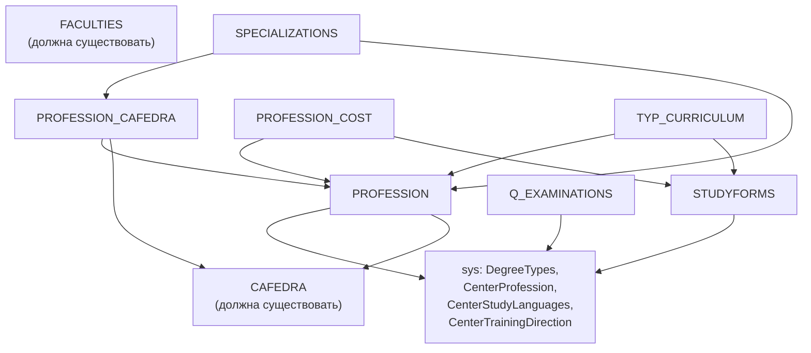

# RF — TFW-9: Инструкция по синхронизации Реестра образовательных программ

> **Дата**: 2026-04-15
> **Автор**: Executor (AI)
> **Статус**: 🟢 RF — Ожидает ревью координатора
> **Parent TS**: [TS__TFW-9](TS__TFW-9__education_programs_sync.md)

---

## Преамбула

Данный документ описывает бизнес-логику передачи данных **Реестра образовательных программ** в ЕПВО через API. Документ нейтрален к конкретной ИС ОВПО — описывает **что** и **в каком порядке** отправлять, а не откуда брать данные.

**Основной эндпоинт:** `POST /org-data/list/save` (UPSERT, массив JSON-объектов).

**Критичные свойства UPSERT:**
- Данные передаются массивом JSON, даже для одной записи: `[ { ... } ]`
- **Full Replace:** при обновлении **все поля** должны быть переданы. Пропущенное поле → `null` (Источник: KNOWLEDGE.md §1.1)
- Частичный успех возможен: API вернёт 200 OK и список ошибок в `failedRecords`

---

## §1. PROFESSION — Группы образовательных программ (ГОП)

### §1.1. Composite Key

| typeCode | Composite Key | Ключевое поле |
|----------|--------------|---------------|
| `PROFESSION` | `PROFESSION_ID_COMPOSITE_KEY` | `professionId` |

При UPSERT ЕПВО ищет существующую запись по паре `(typeCode, professionId)`. Если найдена — перезаписывает. Иначе — создаёт новую.

### §1.2. Матрица полей

| Поле | Тип | Обяз. | Описание | Бизнес-правила / Источник |
|------|-----|:-----:|----------|---------------------------|
| `typeCode` | string | ✅ | Всегда `"PROFESSION"` | Константа |
| `universityId` | int32 | ✅ | ID ОВПО в ЕПВО | Выдаётся МНВО ДЦ (KNOWLEDGE.md §1.3) |
| `professionId` | int32 | ✅ | Уникальный ID ГОП/специальности в ИС ОВПО | Не должно быть пустым. Уникальное. (adm_doc строка 1817) |
| `classifier` | int32 | ✅ | Тип классификатора | См. Правило 1 |
| `professionNameRu` | string | ✅ | Название ГОП на русском | Не должно быть пустым (adm_doc строка 1836) |
| `professionNameKz` | string | ✅ | Название ГОП на казахском | Не должно быть пустым (adm_doc строка 1844) |
| `professionNameEn` | string | ✅ | Название ГОП на английском | Не должно быть пустым (adm_doc строка 1852) |
| `professionCode` | string | ✅ | Код ГОП (внутренний код ОВПО) | См. Правило 2. Не должно быть пустым (adm_doc строка 1860) |
| `code` | string | ✅ | Код из центрального справочника `center_profession` | **⚠️ Не путать с `professionCode`!** См. Правило 2 и §7 |
| `centerProfId` | int64 | — | ID из `CenterProfession` | Результат Lookup (§7). FK → sys:CenterProfession |
| `cafedraId` | int32 | — | Кафедра, за которой закреплена ГОП | FK → CAFEDRA (должна быть создана до PROFESSION) |
| `degreeTypeId` | int32 | — | Академическая степень | FK → sys:DegreeTypes (1=Бакалавриат, 2=Маг.науч., 3=Маг.проф., 6=PhD, 7=Док.направ., 8=Специалитет) |
| `studyFormId` | int32 | — | Форма обучения | FK → STUDYFORMS (справочник ОВПО, §4) |
| `accredited` | boolean | — | Аккредитована ли ГОП | — |
| `studyPeriod` | int32 | — | Срок обучения **в семестрах** | Например: бакалавриат 4 года = 8 семестров (RF_TFW-1.2) |
| `trainingDirectionsId` | int32 | — | Направление подготовки | FK → sys:CenterTrainingDirection |
| `deleted` | int32 | — | Закрытая ГОП | Если ГОП больше не действует (adm_doc строка 1870) |
| `created` | date | — | Дата создания записи | — |

### §1.3. Бизнес-правила

**Правило 1: classifier — Тип записи**

Таблица `professions` хранит **два вида** записей в одном справочнике:

```
classifier = 1  →  Специальность (старый формат, до 2018)
classifier = 2  →  Группа образовательных программ (ГОП) — основной формат
```

> Источник: adm_doc.txt строки 1825–1834

⚠️ **Обе записи передаются в одну сущность `PROFESSION`** с одинаковым `typeCode`. Различаются только значением `classifier`.

**Правило 2: code ≠ professionCode — два разных поля**

```
professionCode  — код ГОП/специальности, присвоенный ОВПО ИЛИ по МСКО
                  (adm_doc строки 1860–1865: "Код специальности/группы образовательных программ")

code            — код из центрального справочника center_profession
                  (adm_doc строки 1877–1884: "Код специальности/группы образовательных программ 
                   из центрального справочника center_profession")
```

> ⚠️ **Критично:** Поле `code` используется для **сопоставления** записи ОВПО с центральным справочником МНВО. Если передать неверный `code`, ЕПВО может не привязать ГОП к классификатору. Корректный `code` получается через Lookup (§7).

**Правило 3: studyPeriod — единица измерения**

```
studyPeriod = количество СЕМЕСТРОВ (не лет, не месяцев)

IF degreeTypeId = 1 (Бакалавриат, 4 года):
    studyPeriod = 8
ELIF degreeTypeId IN (2, 3) (Магистратура, 1-2 года):
    studyPeriod = 2 ... 4
ELIF degreeTypeId IN (6, 7) (Докторантура, 3 года):
    studyPeriod = 6
```

> Источник: RF_TFW-1.2 §1 ("Срок обучения (в семестрах)")
> ⚠️ Не путать с `duration` из RF_TFW-4.B §3.2 (месяцы у ОП) — это разные сущности.

### §1.4. JSON-пример (полный пайлоад)

```json
[
  {
    "typeCode": "PROFESSION",
    "universityId": 999,
    "professionId": 401,
    "classifier": 2,
    "professionCode": "6B01",
    "code": "6B01",
    "professionNameRu": "Педагогические науки",
    "professionNameKz": "Педагогика ғылымдары",
    "professionNameEn": "Pedagogical Sciences",
    "cafedraId": 201,
    "degreeTypeId": 1,
    "studyFormId": 1,
    "centerProfId": 100500,
    "accredited": true,
    "studyPeriod": 8,
    "trainingDirectionsId": 5,
    "deleted": null
  }
]
```

---

## §2. SPECIALIZATIONS — Образовательные программы (ОП)

### §2.1. Composite Key

| typeCode | Composite Key | Ключевое поле |
|----------|--------------|---------------|
| `SPECIALIZATIONS` | `UNIVERSITY_ID_COMPOSITE_KEY` | `id` |

При UPSERT ЕПВО ищет запись по паре `(typeCode, id)`.

### §2.2. Матрица полей

#### Обязательные поля (О)

| Поле | Тип | Описание | Бизнес-правила / Источник |
|------|-----|----------|---------------------------|
| `typeCode` | string | Всегда `"SPECIALIZATIONS"` | Константа |
| `universityId` | int32 | ID ОВПО в ЕПВО | — |
| `id` | int32 | Уникальный ID ОП в ИС ОВПО | adm_doc строка 6104 |
| `prof_caf_id` | int32 | **ID привязки ОП к кафедре** | **⚠️ См. Правило 4.** FK → PROFESSION_CAFEDRA.id |
| `nameRu` | string | Название ОП на русском | adm_doc строка 6148 |
| `nameKz` | string | Название ОП на казахском | adm_doc строка 6131 |
| `nameEn` | string | Название ОП на английском | adm_doc строка 6154 |
| `created` | date | Дата и время создания | adm_doc строка 6160 |
| `modified` | date | Дата и время изменения | adm_doc строка 6168 |
| `statusep` | int32 | Статус включения в Реестр ОП | См. Правило 5 |
| `eduprogtype` | int32 | Вид ОП | См. Правило 6 |
| `profession_id` | int32 | ID ГОП/специальности, к которой относится ОП | FK → PROFESSION.professionId (adm_doc строка 6291) |

#### Условно-обязательные поля (УО)

| Поле | Тип | Описание | Условие обязательности |
|------|-----|----------|------------------------|
| `specializationCode` | string | Код ОП | Обязателен, если `center_profession.classifier=2`. См. Правило 7 |
| `universitytype` | int32 | Тип ОВПО-партнёра (1=Отечественный, 2=Зарубежный) | Для совместных ОП (§2.4) |
| `partneruniverid` | int32 | ID ОВПО-партнёра | Для совместных ОП. См. Правило 8 |

#### Необязательные поля (НО)

| Поле | Тип | Описание | Источник |
|------|-----|----------|----------|
| `is_interdisciplinary` | boolean | Междисциплинарная ОП | adm_doc строка 6177. Влияет на формат `specializationCode` (Правило 7) |
| `doublediploma` | boolean | Двудипломное образование | adm_doc строка 6183 |
| `jointep` | boolean | Совместная ОП | adm_doc строка 6191 |
| `descriptionRu` | string | Описание ОП (русский) | varchar(4096). Чат Бахтияр 2023-11-17 |
| `descriptionKz` | string | Описание ОП (казахский) | varchar(4096) |
| `descriptionEn` | string | Описание ОП (английский) | varchar(4096) |
| `ignore_rms` | boolean | Не учитывать при передаче для СУР | Чат Айдар 2025-10-09, adm_doc строка 6311 |
| `ignore_rms_reason` | int32 | Причина исключения из СУР | 1=Недавно включена, нет выпуска; 2=Доучивание последних курсов (adm_doc строка 6349) |
| `forOop` | boolean | Предусмотрена для лиц с ООП | Чат Бахтияр 2026-03-04: "не новые поля" |
| `trainingForOop` | boolean | Подготовка специалистов по работе с лицами с ОВЗ | adm_doc строка 6478 |
| `academic_degree_ba_awarded` | boolean | Присуждается степень «МДА» / «ДДА» | Условие: center_profession.training_directions_id ∈ {74, 130} AND degree_id ∈ {3, 7}. (adm_doc строка 6317) |
| `trainingformatid` | int32 | Формат обучения | 0=оффлайн, 1=дистанционный, 2=смешанный (adm_doc строка 6405) |

#### Поля совместных ОП (НО, блок §2.4)

| Поле | Тип | Описание |
|------|-----|----------|
| `contractstart` | date | Дата заключения договора совместной ОП |
| `contractfinish` | date | Срок действия договора |
| `specinppscount` | int32 | Кол-во ППС из данного ОВПО |
| `specoutppscount` | int32 | Кол-во ППС от ОВПО-партнёра |
| `hpeototaltermcount` | int32 | Кол-во академических периодов в данном ОВПО |
| `partnertotaltermcount` | int32 | Кол-во академических периодов в ОВПО-партнёре |
| `diplomatypeid` | int32 | Тип диплома совместной ОП |
| `diplomaissuerid` | int32 | Кто выдаёт диплом: 0=Два равноценных, 1=Основной и дополнительный |

### §2.3. Бизнес-правила

**Правило 4: prof_caf_id — привязка ОП к кафедре через мостовую таблицу**

```
specializations.prof_caf_id → profession_cafedra.id → professions.professionid

Путь JOIN:
  SPECIALIZATIONS
    └── prof_caf_id → PROFESSION_CAFEDRA.id
                         └── professionId → PROFESSION.professionId
                         └── cafedraId   → CAFEDRA.cafedraId
```

> Источник: Бахтияр (чат 2025-09-19), adm_doc строка 6117–6129
>
> ⚠️ `prof_caf_id` — это НЕ `professionId` и НЕ `cafedraId`. Это ID связующей записи из таблицы `PROFESSION_CAFEDRA` (§3). Передача `professionId` из центрального справочника вместо `prof_caf_id` → **ошибка 500** (Dinara, чат 2023-10-30).

**Правило 5: statusep — статус ОП в Реестре**

```
statusep = 0  →  Не включена в Реестр ОП
statusep = 1  →  Включена в Реестр ОП
statusep = 2  →  Исключена из Реестра ОП
```

> Источник: adm_doc строки 6273–6282
>
> ⚠️ **Включение ОП в Реестр ≠ отправка через API.** Для включения/обновления ОП в Реестре необходимо подать заявку через НЦРВО: https://enic-kazakhstan.edu.kz/ru/reestr-op/ovpo-1 (Чат Бахтияр 2025-05-12)

**Правило 6: eduprogtype — вид ОП**

```
eduprogtype = 1  →  Действующая ОП
eduprogtype = 2  →  Новая ОП
eduprogtype = 3  →  Инновационная ОП
```

> Источник: adm_doc строки 6283–6290
>
> ⚠️ Системный справочник для этого поля **не существует** (Чат: вопрос Каиржана 2025-09-16 остался без ответа). Значения захардкожены.

**Правило 7: specializationCode — формат кода ОП**

```
IF specializations.is_interdisciplinary = true:
    specializationCode = [код_области_образования (4 цифры)] + "088" + [порядковый_номер (2 цифры)]
    Пример: "6B04" + "088" + "01" = "6B0408801"
ELSE:
    specializationCode = [код_направления_подготовки (5 цифр)] + [порядковый_номер (2 цифры)]
    Пример: "6B041" + "01" = "6B04101"

Условие обязательности: поле обязательно, если center_profession.classifier = 2 (ГОП)
```

> Источник: adm_doc строки 6224–6247

**Правило 8: partneruniverid — ID ОВПО-партнёра (совместные ОП)**

```
IF universitytype = 1 (Отечественный):
    partneruniverid → ID из центральной таблицы universities
ELIF universitytype = 2 (Зарубежный):
    partneruniverid → ID из таблицы foreignuniversities
```

> Источник: adm_doc строки 6205–6223

### §2.4. Совместные ОП (Joint Programs)

Совместные образовательные программы активируются комбинацией полей:
- `doublediploma = true` — программа двудипломного образования
- `jointep = true` — совместная образовательная программа

При активации становятся обязательными: `universitytype`, `partneruniverid`, `contractstart`, `contractfinish`, `specinppscount`, `specoutppscount`, `diplomatypeid`, `diplomaissuerid`.

### §2.5. JSON-пример (полный пайлоад)

```json
[
  {
    "typeCode": "SPECIALIZATIONS",
    "universityId": 999,
    "id": 501,
    "prof_caf_id": 10,
    "profession_id": 401,
    "nameRu": "Информатика",
    "nameKz": "Информатика",
    "nameEn": "Computer Science",
    "specializationCode": "6B04101",
    "statusep": 1,
    "eduprogtype": 1,
    "is_interdisciplinary": false,
    "doublediploma": false,
    "jointep": false,
    "forOop": false,
    "trainingForOop": false,
    "ignore_rms": false,
    "trainingformatid": 0,
    "descriptionRu": "Программа подготовки специалистов в области IT...",
    "descriptionKz": "IT саласында мамандарды даярлау бағдарламасы...",
    "descriptionEn": "Program for training IT specialists...",
    "created": "2020-09-01",
    "modified": "2025-01-15"
  }
]
```

---

## §3. PROFESSION_CAFEDRA — Привязка ГОП к кафедрам

### Composite Key

| typeCode | Composite Key | Ключевое поле |
|----------|--------------|---------------|
| `PROFESSION_CAFEDRA` | `UNIVERSITY_ID_COMPOSITE_KEY` | `id` |

### Матрица полей

| Поле | Тип | Обяз. | Описание |
|------|-----|:-----:|----------|
| `typeCode` | string | ✅ | `"PROFESSION_CAFEDRA"` |
| `universityId` | int32 | ✅ | ID ОВПО |
| `id` | int32 | ✅ | Уникальный ID связи (используется как `prof_caf_id` в SPECIALIZATIONS) |
| `professionId` | int32 | — | FK → PROFESSION.professionId |
| `cafedraId` | int32 | — | FK → CAFEDRA.cafedraId |

> **Роль в pipeline:** Мостовая таблица. Без неё невозможно корректно привязать ОП к ГОП и кафедре (Правило 4).

### JSON-пример

```json
[
  {
    "typeCode": "PROFESSION_CAFEDRA",
    "universityId": 999,
    "id": 10,
    "professionId": 401,
    "cafedraId": 201
  }
]
```

---

## §4. STUDYFORMS — Формы обучения (справочник ОВПО)

### Composite Key

| typeCode | Composite Key | Ключевое поле |
|----------|--------------|---------------|
| `STUDYFORMS` | `UNIVERSITY_ID_COMPOSITE_KEY` | `id` |

### Матрица полей

| Поле | Тип | Обяз. | Описание | Источник |
|------|-----|:-----:|----------|----------|
| `typeCode` | string | ✅ | `"STUDYFORMS"` | — |
| `universityId` | int32 | ✅ | ID ОВПО | — |
| `id` | int32 | ✅ | Уникальный ID формы обучения | adm_doc строка 1904 |
| `degreeId` | int32 | ✅ | Академическая степень | FK → sys:DegreeTypes (adm_doc строка 1920) |
| `nameRu` | string | ✅ | Название формы обучения (рус.) | adm_doc строка 1928 |
| `nameKz` | string | ✅ | Название формы обучения (каз.) | adm_doc строка 1934 |
| `nameEn` | string | ✅ | Название формы обучения (англ.) | adm_doc строка 1940 |
| `courseCount` | int32 | ✅ | Макс. количество курсов | adm_doc строка 1946 |
| `creditsCount` | int32 | ✅ | Кредиты для завершения программы | adm_doc строка 1952 |
| `termsCount` | int32 | ✅ | Академических периодов в учебном году | adm_doc строка 1958 |
| `departmentId` | int32 | ✅ | Отделение (1=Очное, 2=Вечернее, 3=Заочное, 4=Очное) | FK → sys:Department (adm_doc строка 1964) |
| `Base_Education_Id` | int32 | ✅ | Базовое образование | 1=Среднее, 2=Средне-спец., 3=Высшее, 4=Другое (adm_doc строка 1971) |
| `TrainingCompletionTerm` | int32 | ✅ | Академич. период завершения программы | ≤ termsCount (adm_doc строка 1986) |
| `distance_learning` | boolean | — | Дистанционное обучение | adm_doc строка 1981 |
| `in_use` | boolean | — | Используется ли форма | adm_doc строка 1996 |

---

## §5. Вспомогательные сущности (табличный обзор)

| Сущность | typeCode | Composite Key | Ключ | FK-зависимости |
|----------|----------|--------------|------|----------------|
| **PROFESSION_COST** | `PROFESSION_COST` | `PROFESSION_COST_ID_COMPOSITE_KEY` | `costId` | PROFESSION, STUDYFORMS, DegreeTypes |
| **TYP_CURRICULUM** | `TYP_CURRICULUM` | `CURRICULUM_ID_COMPOSITE_KEY` | `curriculumId` | PROFESSION, STUDYFORMS |
| **Q_EXAMINATIONS** | `Q_EXAMINATIONS` | `EXAM_ID_COMPOSITE_KEY` | `examId` | DegreeTypes |
| **EDUCATION_PROGRAMS_CODE** | `EDUCATION_PROGRAMS_CODE` | `UNIVERSITY_ID_COMPOSITE_KEY` | `id` | нет |

Полные маппинги полей: см. RF_TFW-1.2 §§4–7.

---

## §6. Sequencing Contract

### §6.1. Граф зависимостей



### §6.2. Порядок UPSERT

| Шаг | Сущность | Зависит от | Обоснование |
|:---:|----------|-----------|-------------|
| 0 | Предусловие: `FACULTIES`, `CAFEDRA` | — | Должны быть загружены заранее. Без кафедр невозможно создать `PROFESSION_CAFEDRA` |
| 1 | **PROFESSION** | `CAFEDRA`, sys:`DegreeTypes`, sys:`CenterProfession` | Корневая сущность. Все остальные ссылаются на `professionId` |
| 2 | **STUDYFORMS** | sys:`DegreeTypes`, sys:`Department` | Справочник ОВПО. Не зависит от PROFESSION, но нужен для PROFESSION_COST и TYP_CURRICULUM |
| 3 | **PROFESSION_CAFEDRA** | `PROFESSION`, `CAFEDRA` | Мостовая таблица. Создаёт `id`, который используется как `prof_caf_id` в SPECIALIZATIONS |
| 4 | **SPECIALIZATIONS** | `PROFESSION_CAFEDRA`, `PROFESSION` | ОП привязывается к ГОП через `prof_caf_id` |
| 5 | **PROFESSION_COST** *(опц.)* | `PROFESSION`, `STUDYFORMS` | Стоимость обучения |
| 6 | **TYP_CURRICULUM** *(опц.)* | `PROFESSION`, `STUDYFORMS` | Типовые учебные планы |
| 7 | **EDUCATION_PROGRAMS_CODE** *(опц.)* | нет | Коды аккредитованных ОП (независимая) |
| 8 | **Q_EXAMINATIONS** *(опц.)* | sys:`DegreeTypes` | Типы гос. аттестации |

> ⚠️ **Нарушение порядка → ошибки:** Отправка SPECIALIZATIONS до PROFESSION_CAFEDRA приведёт к невалидному `prof_caf_id`. Отправка PROFESSION_CAFEDRA до PROFESSION — к невалидному `professionId`.

---

## §7. Lookup: CenterProfession

### §7.1. Эндпоинт системного справочника

```
GET /api/v1/system-dictionary/CenterProfession
Authorization: Basic <base64(universityId:password)>
```

**Ответ:** Массив объектов:
```json
[
  {
    "id": 100500,
    "code": "6B01",
    "nameRu": "Педагогические науки",
    "nameKz": "Педагогика ғылымдары",
    "nameEn": "Pedagogical Sciences",
    "parentId": null,
    "levelId": null
  },
  ...
]
```

> ⚠️ Структура `CenterProfession` может содержать дополнительные поля (`parentId`, `levelId`, `msko`, `gkz`). Точная структура не полностью задокументирована в OpenAPI (Риск из HL §9).

### §7.2. Алгоритм сопоставления по коду

```
ВХОД: local_profession_code (код ГОП из ИС ОВПО)

1. Запросить справочник:
   center_list = GET /api/v1/system-dictionary/CenterProfession

2. Найти запись:
   match = FIND(center_list, WHERE center.code == local_profession_code)

3. IF match FOUND:
       PROFESSION.centerProfId = match.id
       PROFESSION.code = match.code
   ELSE:
       → Перейти к §7.3 (обработка старых кодов)
```

### §7.3. Обработка старых кодов (до 2018)

До 2018–2019 гг. специальности в РК кодировались по старому классификатору МСКО:
- Бакалавриат: `5B...` (напр. `5B042000`)
- Магистратура: `6M...` (напр. `6M042000`)

Новый классификатор ГОП:
- Бакалавриат: `6B...` (напр. `6B04101`)
- Магистратура: `7M...` (напр. `7M04101`)
- Докторантура: `8D...` (напр. `8D04101`)

**Алгоритм fallback:**

```
IF local_code STARTS WITH "5B" OR "6M" OR "5M":
    // Старый формат — невозможно автоматическое сопоставление
    
    1. Попытка ручного маппинга:
       old_to_new_map = {
           "5B042000": "6B04201",  // Юриспруденция (пример)
           "5B010200": "6B01102",  // Педагогика и психология (пример)
           ...
       }
       IF local_code IN old_to_new_map:
           new_code = old_to_new_map[local_code]
           → Повторить Lookup (§7.2) с new_code
       ELSE:
           LOG_WARNING("Старый код " + local_code + " не имеет маппинга на ГОП")
           PROFESSION.centerProfId = NULL
           PROFESSION.code = local_code  // Отправить как есть, без привязки

    2. При массовой интеграции:
       → Выгружать все записи с старыми кодами в отдельный Excel
       → Передать координатору ОВПО для ручного маппинга
```

> Источник: RF_TFW-4.B §4 Risk 1, чат ЕПВО (Dark Moon 2025-09-12, Бахтияр 2025-08-29)
>
> ⚠️ **Таблица маппинга `5B → 6B` не предоставляется ЕПВО централизованно.** Каждый ОВПО должен составить её самостоятельно на основе данных МНВО.

---

## §8. Gotchas

| # | Ловушка | Описание | Источник |
|---|---------|----------|----------|
| 1 | **`code` ≠ `professionCode`** | Два разных поля в PROFESSION. `code` — из центрального справочника, `professionCode` — внутренний код ОВПО. Путаница → ЕПВО не привяжет ГОП к классификатору | adm_doc строки 1860–1884 |
| 2 | **`prof_caf_id` ≠ `professionId`** | ОП привязывается к ГОП через мостовую таблицу `PROFESSION_CAFEDRA`. Передача `professionId` (или, хуже, ID из `CenterProfession`) вместо `prof_caf_id` → **ошибка 500** | Чат Dinara 2023-10-30, Бахтияр 2025-09-19 |
| 3 | **`classifier=1` vs `classifier=2`** | Два типа записей в одной таблице `professions`. Если не указать `classifier`, ЕПВО не различит Специальность и ГОП | adm_doc строки 1825–1834 |
| 4 | **`specializationCode` зависит от `is_interdisciplinary`** | Формат кода ОП различается: с "088" для междисциплинарных, без — для обычных. Неверный формат → ОП отклоняется НЦРВО | adm_doc строки 6224–6247 |
| 5 | **Full Replace** | При UPSERT PROFESSION/SPECIALIZATIONS **все поля** должны быть переданы повторно. Если отправить только изменённые — остальные сбросятся в `null` | KNOWLEDGE.md §1.1, Чат Бахтияр 2023-06-26 |
| 6 | **Реестр ОП ≠ API** | Отправка `statusep=1` через API **НЕ** включает ОП в Реестр. Включение/обновление требует заявки через НЦРВО (enic-kazakhstan.edu.kz) | Чат Бахтияр 2025-05-12 |
| 7 | **Подготовительное отделение** | Для студентов подготовительного отделения **не заполнять** `professionId` и `specializationId` в таблице `STUDENT` | Чат Account 2023-10-17 |
| 8 | **`edu_prog_type` без справочника** | Поле `eduprogtype` не имеет системного справочника. Значения 1/2/3 захардкожены в документации, не получены через API | Чат Каиржан 2025-09-16 (вопрос без ответа), adm_doc строки 6283–6290 |
| 9 | **`centerProfChecked` / `centerProfessionCode` — deprecated** | В GRADUATES эти поля убраны из API (2025-09-12). Используйте `professionId` вместо `centerProfessionCode` | Чат Dark Moon 2025-09-12 |
| 10 | **Naming Trap: поле API ≠ имя в документации** | ЕПВО **не возвращает ошибку** при неизвестном имени поля — молча игнорирует его (HTTP 200 OK, но данные не сохранены). Проверяйте каждое имя через `find-all-pageable` после отправки | KNOWLEDGE.md §1.6 |

---

## §9. Acceptance Criteria (проверка)

| # | Критерий | Статус |
|---|---------|:------:|
| 1 | Маппинг ≥8 полей PROFESSION с бизнес-правилами | ✅ 17 полей, 3 правила |
| 2 | Маппинг ≥15 полей SPECIALIZATIONS с бизнес-правилами | ✅ 30+ полей, 5 правил (4–8) |
| 3 | Sequencing Contract: 4+ шага с FK-обоснованием | ✅ 8 шагов (0–7) + mermaid граф |
| 4 | Lookup CenterProfession: endpoint + алгоритм + fallback | ✅ §7 (3 подсекции) |
| 5 | ≥5 Gotchas с источниками | ✅ 10 gotchas |
| 6 | JSON-примеры PROFESSION и SPECIALIZATIONS | ✅ §1.4, §2.5 |
| 7 | Вспомогательные сущности: табличный обзор | ✅ §3 (PROFESSION_CAFEDRA), §4 (STUDYFORMS), §5 (обзор 4-х) |
| 8 | Нейтральность к ИС ОВПО | ✅ Описывает «что отправить», не «откуда взять» |
| 9 | Observations в отдельной секции | ✅ §10 |

---

## §10. Observations (out-of-scope, не модифицировано)

| # | Файл/Артефакт | Тип | Описание |
|---|---------------|-----|----------|
| 1 | RF_TFW-1.2 §2 | inconsistency | SPECIALIZATIONS показывает только 10 полей из OpenAPI. adm_doc Таблица 24 содержит 30+ полей. OpenAPI spec неполный для этой сущности |
| 2 | RF_TFW-1.2 §2 | inconsistency | Поле показано как `professionId` (прямая FK → Profession), но фактически ОП привязывается через `prof_caf_id` → `PROFESSION_CAFEDRA`. OpenAPI spec не отражает мостовую связь |
| 3 | RF_TFW-4.B §3.1 | naming | Поле `duration` описано как "срок обучения в месяцах", но в RF_TFW-1.2 PROFESSION поле `studyPeriod` указано как "в семестрах". Разные единицы для разных сущностей — может вводить в заблуждение |
| 4 | KNOWLEDGE.md | missing | Нет раздела про ОП/ГОП. Рекомендуется добавить §2.x "Реестр образовательных программ" с ключевыми правилами (classifier, prof_caf_id, statusep ≠ Реестр) |
| 5 | RF_TFW-4.B §3 | naming | Сущность называется `EducationProgram`, но фактический typeCode = `SPECIALIZATIONS`. Расхождение терминологии |

---

*RF — TFW-9: Инструкция по синхронизации Реестра образовательных программ | 2026-04-15*
